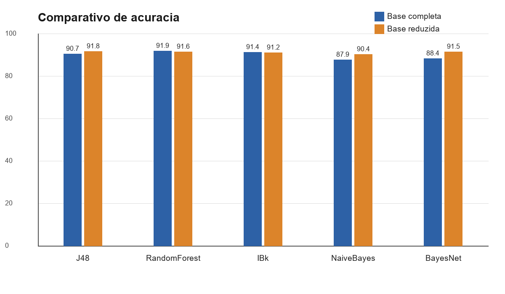
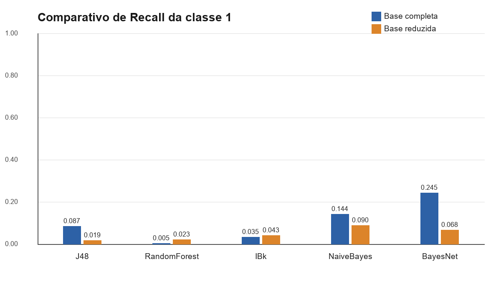
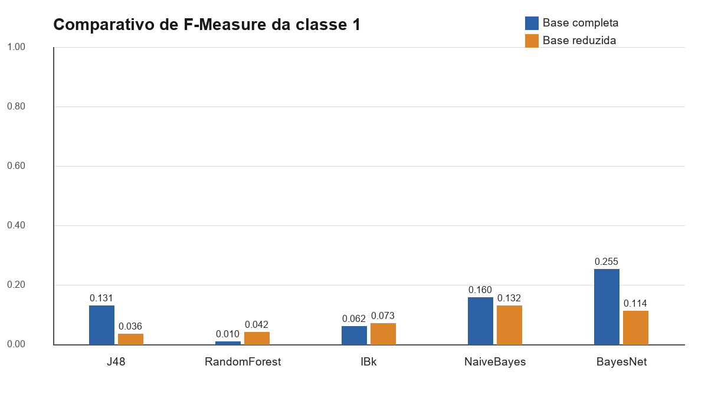
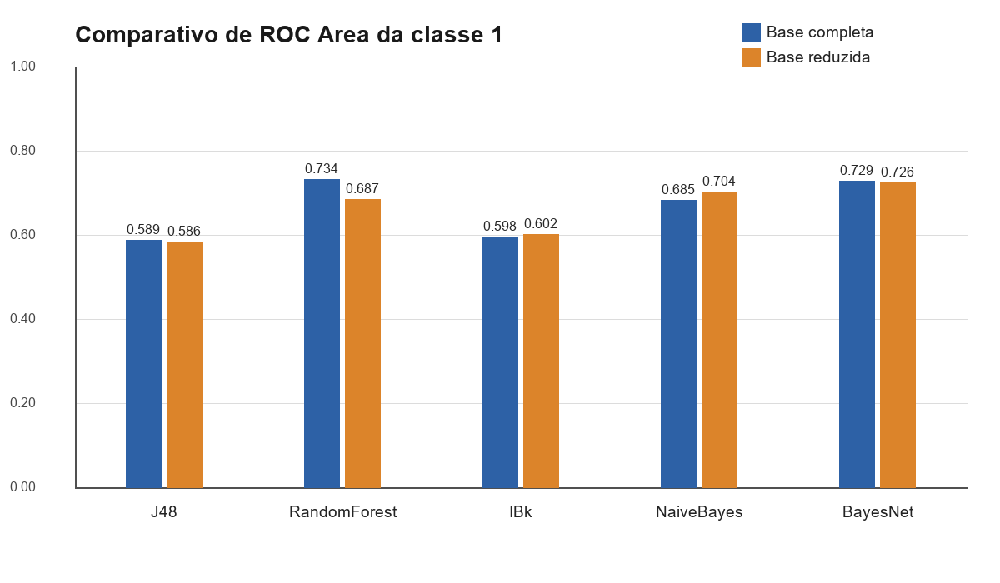
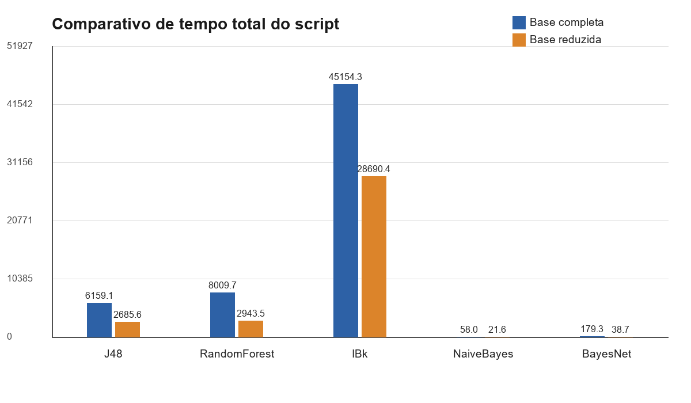

# Relatorio base para formatacao ABNT - Trabalho 2 de Classificacao

Este documento reune o conteudo completo para a elaboracao do relatorio final em PDF no padrao ABNT. O texto esta organizado conforme o modelo solicitado no enunciado: introducao com objetivo do trabalho, descricao da tarefa, descricao dos metodos, descricao das bases, configuracoes feitas e comparacao dos resultados sob diversas metricas. Os dados numericos foram extraidos das saidas reais do WEKA e dos arquivos consolidados `resultados_classificacao.csv` e `comparativo_metricas.csv`.

Observacao para a formatacao final: este arquivo foi escrito como base textual. Ao converter para DOCX/PDF, revisar acentuacao, pagina inicial, folha de rosto, sumario automatico, numeracao de tabelas, numeracao de figuras, fonte, espacamento, margens e demais requisitos formais da ABNT.

## Identificacao do trabalho

| Item | Descricao |
| --- | --- |
| Instituicao | Universidade Federal de Uberlandia |
| Faculdade | Faculdade de Computacao |
| Disciplina | Ciencia de Dados |
| Professor | Carlos Cesar Mansur Tuma |
| Trabalho | Trabalho Pratico 2 - Classificacao |
| Tema | Classificacao para concessao de credito |
| Ferramenta principal | WEKA executado por linha de comando via `weka.jar` |
| Local | Monte Carmelo - MG |
| Ano | 2026 |

### Autores

- Gil Antony Borba
- Raphael Muniz Varela
- Victor Leal
- Ygor Marangoni

### Titulo sugerido

Relatorio de Classificacao para Concessao de Credito

## Sumario sugerido

1. Introducao com objetivo do trabalho
2. Descricao da tarefa
3. Metodologia de execucao
4. Descricao dos metodos
5. Descricao das bases
6. Configuracoes feitas
7. Selecao de atributos pelo J48
8. Resultados da Rodada 1 - base completa
9. Resultados da Rodada 2 - base reduzida
10. Comparacao dos resultados sob diversas metricas
11. Matrizes de confusao
12. Visualizacao dos resultados
13. Analise critica
14. Conclusao
15. Referencias
16. Apendices

## 1. Introducao com objetivo do trabalho

Este relatorio apresenta os resultados do Trabalho Pratico 2 da disciplina de Ciencia de Dados. O objetivo central foi aplicar, avaliar e comparar metodos de classificacao supervisionada sobre a base final produzida no Trabalho Pratico 1. A base utilizada representa um problema de concessao de credito, em que o modelo deve classificar clientes entre uma classe majoritaria de clientes considerados saudaveis e uma classe minoritaria de clientes considerados de risco.

O trabalho foi executado utilizando o WEKA, ferramenta amplamente empregada em tarefas de mineracao de dados e aprendizado de maquina. Todos os classificadores foram executados a partir do `weka.jar`, por linha de comando, com validacao cruzada de 10 folds. Os scripts Python usados no projeto tiveram papel auxiliar: prepararam arquivos em formato adequado, chamaram o WEKA, consolidaram metricas, extraim atributos relevantes e geraram tabelas e graficos. Eles nao substituiram os classificadores do WEKA e nao simularam resultados.

A proposta do experimento foi organizada em duas rodadas. Na primeira, os cinco metodos indicados no enunciado foram executados sobre a base completa. Depois, a arvore de decisao J48 foi usada para identificar atributos relevantes. Com esses atributos foi criada uma base reduzida. Na segunda rodada, os metodos foram novamente executados, agora sobre a base reduzida. A comparacao entre as duas rodadas permite avaliar se a reducao de atributos melhora, piora ou simplifica o processo de classificacao.

Como o problema envolve risco de credito, a avaliacao nao pode se limitar a acuracia. A classe `TARGET = 1`, associada a clientes de risco, e minoritaria e representa o grupo de maior interesse para a decisao. Por isso, este relatorio analisa acuracia, taxa de verdadeiros positivos, taxa de falsos positivos, precisao, recall, F-Measure, area ROC, matriz de confusao, coeficiente kappa e tempos de processamento.

## 2. Descricao da tarefa

A tarefa realizada foi uma classificacao binaria. A variavel alvo foi `TARGET`, com os seguintes significados:

| Classe | Significado no problema |
| --- | --- |
| `TARGET = 0` | Cliente saudavel, sem indicacao de risco na base |
| `TARGET = 1` | Cliente de risco, classe minoritaria e mais critica para a analise |

O enunciado solicitou a execucao dos metodos correspondentes no WEKA com validacao cruzada de 10 folds. Tambem solicitou que, apos a execucao dos metodos, fossem selecionados os atributos mais relevantes encontrados pelo ID3/J48 e os outros metodos fossem reexecutados usando esses atributos. Neste trabalho, a selecao foi feita a partir da arvore J48 gerada na primeira rodada, porque o J48 e a implementacao disponivel no WEKA para arvores de decisao baseadas no algoritmo C4.5, uma evolucao do ID3.

A tarefa foi executada em duas etapas principais:

| Etapa | Descricao | Base usada |
| --- | --- | --- |
| Rodada 1 | Execucao dos cinco classificadores com todos os atributos de entrada da base final | Base completa |
| Selecao de atributos | Extracao dos atributos mais relevantes a partir da arvore J48 da primeira rodada | Saida do J48 |
| Rodada 2 | Reexecucao dos classificadores usando apenas os atributos selecionados pelo J48 | Base reduzida |

A avaliacao foi feita por validacao cruzada estratificada de 10 folds. Esse procedimento divide os dados em 10 partes, treina o modelo em 9 partes e testa na parte restante, repetindo o processo ate que todas as partes tenham sido usadas para teste. A estratificacao preserva a proporcao entre as classes em cada fold, o que e importante porque a base e desbalanceada.

## 3. Metodologia de execucao

A metodologia adotada seguiu um fluxo reprodutivel. Primeiro, a base final do Trabalho 1 foi convertida para um formato compativel com o WEKA. O identificador `SK_ID_CURR` foi removido, pois esse campo apenas identifica registros e nao deve ser usado como atributo preditivo. Em seguida, a classe `TARGET` foi posicionada como ultima coluna e declarada como atributo de classe.

Depois da preparacao da base completa, os cinco classificadores foram executados no WEKA. Cada execucao gerou um arquivo `.txt` contendo as configuracoes, o tempo medido pelo script, a saida completa do WEKA, as metricas de validacao cruzada e a matriz de confusao. A partir desses arquivos foram extraidas as metricas consolidadas.

Na etapa seguinte, a arvore J48 da primeira rodada foi usada para identificar os atributos mais relevantes. O criterio adotado priorizou atributos que apareciam em menor profundidade na arvore e, depois, considerou a ocorrencia ponderada dos atributos. A partir desse processo, foram selecionados 15 atributos e gerada uma nova base ARFF reduzida.

Por fim, os cinco classificadores foram reexecutados sobre a base reduzida. As metricas da segunda rodada foram consolidadas junto com as da primeira rodada, permitindo a comparacao direta entre os metodos e entre as bases.

O fluxo geral pode ser descrito da seguinte forma:

1. Preparar a base completa para o WEKA.
2. Remover o identificador `SK_ID_CURR`.
3. Posicionar `TARGET` como ultima coluna.
4. Executar J48, RandomForest, IBk, NaiveBayes e BayesNet com 10-fold cross-validation.
5. Extrair metricas e matrizes de confusao da base completa.
6. Extrair atributos relevantes da arvore J48.
7. Gerar a base reduzida com 15 atributos.
8. Reexecutar os cinco metodos na base reduzida.
9. Consolidar metricas, tempos e matrizes.
10. Comparar os resultados e gerar visualizacoes.

## 4. Descricao dos metodos

### 4.1 J48 - Arvore de decisao

O J48 e a implementacao do algoritmo C4.5 no WEKA. Ele cria uma arvore de decisao a partir dos atributos da base, dividindo os dados por meio de regras que buscam separar melhor as classes. O modelo resultante e interpretavel, pois apresenta a sequencia de decisoes que leva a classificacao final.

Neste trabalho, o J48 teve duas funcoes. Primeiro, foi avaliado como classificador na base completa e na base reduzida. Segundo, foi usado como mecanismo de selecao de atributos, ja que os atributos presentes nos niveis superiores da arvore tendem a ter maior importancia para a separacao das classes.

### 4.2 RandomForest - Floresta aleatoria

O RandomForest e um metodo de ensemble baseado em multiplas arvores de decisao. Em vez de construir apenas uma arvore, ele constroi varias arvores sobre subconjuntos dos dados e dos atributos, combinando as respostas para gerar a classificacao final. Esse tipo de abordagem costuma apresentar boa capacidade preditiva e reduzir o risco de sobreajuste em comparacao com uma unica arvore.

No experimento, o RandomForest foi avaliado nas duas bases. A metrica de acuracia foi alta, mas a analise da classe `1` mostrou que a acuracia isolada nao foi suficiente para indicar bom desempenho no problema de credito.

### 4.3 IBk - K-vizinhos mais proximos

O IBk e a implementacao do algoritmo KNN no WEKA. O metodo classifica um novo registro com base nos registros mais proximos no conjunto de treinamento. Neste trabalho foi usado `K = 5`, isto e, a classificacao considera os cinco vizinhos mais proximos.

Esse metodo e simples conceitualmente, mas pode ser custoso em bases grandes, pois depende da comparacao entre instancias. Como a base tem 307.511 registros, o IBk apresentou o maior tempo de processamento entre os metodos avaliados.

### 4.4 NaiveBayes

O NaiveBayes e um classificador probabilistico baseado no Teorema de Bayes e na hipotese de independencia condicional entre os atributos. Apesar dessa hipotese ser simplificadora, o metodo costuma ser eficiente e rapido, especialmente em bases grandes.

Neste trabalho, o NaiveBayes teve os menores tempos de execucao. Ele tambem apresentou desempenho razoavel para a classe minoritaria quando comparado a alguns metodos com maior acuracia, reforcando a necessidade de avaliar varias metricas.

### 4.5 BayesNet - Rede Bayesiana

O BayesNet e um classificador probabilistico que utiliza uma estrutura de rede bayesiana para representar dependencias entre atributos. Diferentemente do NaiveBayes, ele permite modelar relacoes mais complexas entre variaveis.

No experimento, o BayesNet da base completa precisou de configuracao ajustada para reduzir consumo de memoria. A execucao final usou ADTree desativada, busca K2 com no maximo 1 pai e SimpleEstimator com alpha 1.0. Mesmo com esse ajuste, a execucao permaneceu sendo realizada no WEKA real com validacao cruzada de 10 folds.

## 5. Descricao das bases

### 5.1 Base completa

A base completa usada neste trabalho foi `base_final_preprocessada.csv`, produzida no Trabalho 1. Essa base foi convertida para `data/base_weka_completa.arff` para uso no WEKA.

| Item | Valor |
| --- | --- |
| Arquivo original usado | `base_final_preprocessada.csv` |
| Arquivo ARFF completo | `data/base_weka_completa.arff` |
| Numero de registros | 307.511 |
| Atributos de entrada | 39 |
| Classe | `TARGET` |
| Classe 0 | 282.686 registros (91,93%) |
| Classe 1 | 24.825 registros (8,07%) |
| Identificador removido | `SK_ID_CURR` |

A distribuicao das classes mostra forte desbalanceamento. A classe `0` representa mais de 90% dos registros, enquanto a classe `1` representa cerca de 8%. Isso afeta a interpretacao da acuracia: um classificador pode obter acuracia elevada simplesmente classificando a maioria dos casos como classe `0`, mas ainda assim falhar na deteccao de clientes de risco.

### 5.2 Base reduzida

A base reduzida foi criada apos a execucao do J48 na base completa. Foram selecionados 15 atributos extraidos da arvore, mantendo a classe `TARGET`. O arquivo gerado para uso no WEKA foi `data/base_weka_reduzida.arff`.

| Item | Valor |
| --- | --- |
| Arquivo ARFF reduzido | `data/base_weka_reduzida.arff` |
| Registros | 307.511 |
| Atributos de entrada | 15 |
| Classe | `TARGET` |
| Metodo de selecao | Atributos relevantes extraidos da arvore J48 |

A reducao de atributos teve o objetivo de verificar se um subconjunto menor de variaveis seria suficiente para manter ou melhorar o desempenho dos classificadores. Ela tambem permitiu avaliar impacto no tempo de processamento, especialmente para metodos mais custosos como IBk e RandomForest.

### 5.3 Atributos selecionados pelo J48

| Ordem | Atributo selecionado |
| --- | --- |
| 1 | `SER_DIVIDA_ATRASADA` |
| 2 | `EXT_SOURCE_3` |
| 3 | `SER_QTDE_PRORROGACOES` |
| 4 | `EXT_SOURCE_2` |
| 5 | `FLAG_OWN_CAR_COD` |
| 6 | `PREV_QTDE_CANCELADO` |
| 7 | `SER_CREDITOS_ATIVOS` |
| 8 | `EXT_SOURCE_1` |
| 9 | `FLAG_EMP_PHONE` |
| 10 | `CNT_CHILDREN` |
| 11 | `REGION_RATING_CLIENT` |
| 12 | `NAME_HOUSING_TYPE_COD` |
| 13 | `CODE_GENDER_COD` |
| 14 | `ORGANIZATION_TYPE_COD` |
| 15 | `FLAG_EMAIL` |

### 5.4 Ranking dos atributos selecionados

| Rank | Atributo | Ocorrencias | Menor profundidade | Score J48 |
| --- | --- | --- | --- | --- |
| 1 | `SER_DIVIDA_ATRASADA` | 46 | 0 | 5.027198 |
| 2 | `EXT_SOURCE_3` | 230 | 1 | 14.449255 |
| 3 | `SER_QTDE_PRORROGACOES` | 58 | 1 | 4.563553 |
| 4 | `EXT_SOURCE_2` | 308 | 2 | 18.646053 |
| 5 | `FLAG_OWN_CAR_COD` | 230 | 2 | 14.120916 |
| 6 | `PREV_QTDE_CANCELADO` | 342 | 3 | 18.970094 |
| 7 | `SER_CREDITOS_ATIVOS` | 314 | 3 | 16.876328 |
| 8 | `EXT_SOURCE_1` | 288 | 3 | 16.873839 |
| 9 | `FLAG_EMP_PHONE` | 74 | 3 | 5.764254 |
| 10 | `CNT_CHILDREN` | 350 | 4 | 19.689883 |
| 11 | `REGION_RATING_CLIENT` | 294 | 4 | 17.367554 |
| 12 | `NAME_HOUSING_TYPE_COD` | 256 | 5 | 14.04717 |
| 13 | `CODE_GENDER_COD` | 188 | 5 | 11.41809 |
| 14 | `ORGANIZATION_TYPE_COD` | 212 | 5 | 10.219555 |
| 15 | `FLAG_EMAIL` | 144 | 5 | 9.331776 |

## 6. Configuracoes feitas

As execucoes foram feitas por linha de comando, usando o WEKA real. A classe foi definida como a ultima coluna da base. A validacao adotada foi a validacao cruzada estratificada com 10 folds e seed 42.

| Item | Configuracao |
| --- | --- |
| Ferramenta | WEKA via `weka.jar` |
| Java | Java 1.8.0_491 |
| Validacao | 10-fold cross-validation |
| Seed | `42` |
| Classe | Ultima coluna (`-c last`) |
| Classe alvo | `TARGET` |
| Base completa | `data/base_weka_completa.arff` |
| Base reduzida | `data/base_weka_reduzida.arff` |
| Memoria Java | `-Xmx8g` na configuracao geral; arquivos da rodada reduzida registram `6g` em algumas execucoes |

### 6.1 Configuracoes por classificador

| Metodo | Classe WEKA | Configuracao usada |
| --- | --- | --- |
| J48 | `weka.classifiers.trees.J48` | `-C 0.25 -M 2` |
| RandomForest | `weka.classifiers.trees.RandomForest` | `-I 100 -S 42` |
| IBk | `weka.classifiers.lazy.IBk` | `-K 5` |
| NaiveBayes | `weka.classifiers.bayes.NaiveBayes` | Padrao do WEKA |
| BayesNet | `weka.classifiers.bayes.BayesNet` | Configuracao ajustada com ADTree desativada, busca K2 com no maximo 1 pai e SimpleEstimator alpha 1.0 quando necessario |

### 6.2 Metricas analisadas

| Metrica | Interpretacao |
| --- | --- |
| Acuracia | Percentual total de instancias classificadas corretamente |
| TP Rate classe 1 | Taxa de verdadeiros positivos para a classe de risco; equivale ao recall da classe 1 |
| FP Rate classe 1 | Taxa de falsos positivos para a classe de risco |
| Precision classe 1 | Entre os casos classificados como risco, proporcao que realmente era risco |
| Recall classe 1 | Entre os clientes de risco reais, proporcao identificada pelo modelo |
| F-Measure classe 1 | Media harmonica entre precision e recall da classe 1 |
| ROC Area classe 1 | Area sob a curva ROC para a classe 1 |
| Kappa | Medida de concordancia corrigida pelo acaso |
| MAE | Erro absoluto medio |
| RMSE | Raiz do erro quadratico medio |
| Tempo do script | Tempo total medido pela execucao automatizada |
| Tempo CV WEKA | Tempo interno informado pelo WEKA para a validacao cruzada |

No contexto de concessao de credito, o recall da classe `1` e especialmente importante, pois falsos negativos representam clientes de risco classificados como saudaveis. Esse tipo de erro pode gerar prejuizo para a instituicao. Por outro lado, falsos positivos representam clientes saudaveis classificados como risco, o que pode levar a recusas indevidas. Assim, a avaliacao precisa equilibrar desempenho preditivo e impacto pratico dos erros.

## 7. Resultados da Rodada 1 - base completa

A primeira rodada utilizou todos os 39 atributos de entrada da base completa. Os resultados abaixo correspondem a validacao cruzada estratificada de 10 folds.

| Metodo | Acuracia | Corretas | Incorretas | Kappa | MAE | RMSE | TP Rate c1 | FP Rate c1 | Precision c1 | Recall c1 | F-Measure c1 | ROC c1 | Tempo script | Tempo CV WEKA |
| --- | --- | --- | --- | --- | --- | --- | --- | --- | --- | --- | --- | --- | --- | --- |
| J48 | 90.6807 | 278.853 | 28.658 | 0.0945 | 0.1397 | 0.2918 | 0.087 | 0.021 | 0.264 | 0.087 | 0.131 | 0.589 | 6159.08 s (1h 42min 39s) | 5692.23 s (1h 34min 52s) |
| RandomForest | 91.9382 | 282.720 | 24.791 | 0.0085 | 0.1417 | 0.2625 | 0.005 | 0.000 | 0.579 | 0.005 | 0.010 | 0.734 | 8009.70 s (2h 13min 30s) | 7177.77 s (1h 59min 38s) |
| IBk | 91.3551 | 280.927 | 26.584 | 0.0428 | 0.1345 | 0.2864 | 0.035 | 0.009 | 0.250 | 0.035 | 0.062 | 0.598 | 45154.33 s (12h 32min 34s) | 33000.80 s (9h 10min 1s) |
| NaiveBayes | 87.8684 | 270.205 | 37.306 | 0.0960 | 0.1383 | 0.3240 | 0.144 | 0.057 | 0.182 | 0.144 | 0.160 | 0.685 | 57.98 s | 38.41 s |
| BayesNet | 88.4089 | 271.867 | 35.644 | 0.1921 | 0.1623 | 0.2981 | 0.245 | 0.060 | 0.265 | 0.245 | 0.255 | 0.729 | 179.30 s (2min 59s) | 153.00 s (2min 33s) |

### 7.1 Analise da Rodada 1

Na base completa, o maior valor de acuracia foi obtido pelo RandomForest, com 91,9382%. Entretanto, esse resultado precisa ser interpretado com cuidado. O RandomForest identificou apenas 124 exemplos da classe `1` como risco, apresentando recall de 0,005 e F-Measure de 0,010 para a classe minoritaria. Isso indica que, apesar da acuracia alta, o modelo praticamente nao identificou clientes de risco.

O BayesNet apresentou acuracia menor, de 88,4089%, mas foi o melhor metodo para a classe `1`. Ele atingiu recall de 0,245 e F-Measure de 0,255, classificando corretamente 6.094 clientes de risco. Em um problema de credito, esse comportamento e mais relevante do que simplesmente obter acuracia alta, pois o objetivo pratico envolve detectar clientes com maior probabilidade de risco.

O NaiveBayes tambem teve desempenho relativamente melhor para a classe `1` do que J48, RandomForest e IBk, com recall de 0,144 e F-Measure de 0,160. Alem disso, foi muito mais rapido que os metodos baseados em arvores e instancia. O IBk apresentou custo computacional muito elevado, levando mais de 12 horas no tempo total medido pelo script. O J48 teve desempenho intermediario, mas seu principal papel adicional foi permitir a selecao de atributos para a segunda rodada.

## 8. Selecao de atributos pelo J48

A selecao de atributos foi feita apos a primeira rodada, utilizando a arvore gerada pelo J48. A arvore de decisao permite observar quais atributos aparecem nas divisoes internas e em que profundidade eles aparecem. Atributos usados mais proximos da raiz tendem a ter maior impacto na separacao inicial dos dados.

O criterio utilizado priorizou atributos com menor profundidade na arvore e, em seguida, considerou ocorrencia ponderada. A lista final manteve 15 atributos. A base reduzida foi entao gerada com esses atributos e a classe `TARGET`.

Essa etapa atende ao requisito do enunciado de selecionar os atributos mais relevantes encontrados pela arvore e reexecutar os metodos. A comparacao posterior permite avaliar se essa reducao preservou o desempenho ou se removeu informacoes importantes.

## 9. Resultados da Rodada 2 - base reduzida

A segunda rodada utilizou a base reduzida, formada pelos 15 atributos selecionados pelo J48. A quantidade de registros permaneceu igual: 307.511. A validacao novamente foi 10-fold cross-validation.

| Metodo | Acuracia | Corretas | Incorretas | Kappa | MAE | RMSE | TP Rate c1 | FP Rate c1 | Precision c1 | Recall c1 | F-Measure c1 | ROC c1 | Tempo script | Tempo CV WEKA |
| --- | --- | --- | --- | --- | --- | --- | --- | --- | --- | --- | --- | --- | --- | --- |
| J48 | 91.8312 | 282.391 | 25.120 | 0.0286 | 0.1441 | 0.2711 | 0.019 | 0.003 | 0.381 | 0.019 | 0.036 | 0.586 | 2685.57 s (44min 46s) | 2533.03 s (42min 13s) |
| RandomForest | 91.6273 | 281.764 | 25.747 | 0.0303 | 0.1408 | 0.2704 | 0.023 | 0.005 | 0.276 | 0.023 | 0.042 | 0.687 | 2943.49 s (49min 3s) | 2310.07 s (38min 30s) |
| IBk | 91.1701 | 280.358 | 27.153 | 0.0494 | 0.1385 | 0.2882 | 0.043 | 0.012 | 0.239 | 0.043 | 0.073 | 0.602 | 28690.44 s (7h 58min 10s) | 18785.99 s (5h 13min 6s) |
| NaiveBayes | 90.4345 | 278.096 | 29.415 | 0.0926 | 0.1296 | 0.2829 | 0.090 | 0.024 | 0.247 | 0.090 | 0.132 | 0.704 | 21.58 s | 12.86 s |
| BayesNet | 91.5086 | 281.399 | 26.112 | 0.0908 | 0.1434 | 0.2682 | 0.068 | 0.010 | 0.361 | 0.068 | 0.114 | 0.726 | 38.74 s | 30.25 s |

### 9.1 Analise da Rodada 2

Na base reduzida, o J48 obteve a maior acuracia, com 91,8312%. Apesar disso, seu recall para a classe `1` caiu para 0,019 e o F-Measure da classe `1` ficou em 0,036. Isso mostra que o ganho de acuracia nao significou melhoria na deteccao de clientes de risco.

O RandomForest tambem manteve acuracia alta, de 91,6273%, mas apresentou recall de apenas 0,023 para a classe `1`. O IBk melhorou ligeiramente seu recall em relacao a base completa, passando de 0,035 para 0,043, mas continuou com baixo desempenho na classe minoritaria e permaneceu com tempo de execucao elevado.

O NaiveBayes foi novamente o metodo mais rapido, com 21,58 segundos no tempo total do script. Ele apresentou recall de 0,090 e F-Measure de 0,132 para a classe `1`, valores inferiores aos da sua execucao na base completa. O BayesNet teve acuracia de 91,5086% e ROC Area de 0,726, mas seu recall caiu de 0,245 na base completa para 0,068 na base reduzida.

De forma geral, a base reduzida reduziu o tempo de processamento, mas nao melhorou a deteccao da classe de risco. A reducao de atributos simplificou a base, mas provavelmente removeu informacoes uteis para identificar a classe minoritaria.

## 10. Comparacao dos resultados sob diversas metricas

Esta secao compara diretamente os resultados da base completa e da base reduzida. A comparacao considera acuracia, taxa de verdadeiros positivos da classe `1`, taxa de falsos positivos da classe `1`, precisao, recall, F-Measure, area ROC e tempo de execucao.

### 10.1 Comparacao geral

| Metodo | Acc completa | Acc reduzida | Delta acc | Recall comp. | Recall red. | Delta recall | F1 comp. | F1 red. | Delta F1 | ROC comp. | ROC red. | Delta ROC | Tempo comp. | Tempo red. |
| --- | --- | --- | --- | --- | --- | --- | --- | --- | --- | --- | --- | --- | --- | --- |
| J48 | 90.6807 | 91.8312 | +1.1505 | 0.087 | 0.019 | -0.068 | 0.131 | 0.036 | -0.095 | 0.589 | 0.586 | -0.003 | 6159.08 s (1h 42min 39s) | 2685.57 s (44min 46s) |
| RandomForest | 91.9382 | 91.6273 | -0.3109 | 0.005 | 0.023 | +0.018 | 0.010 | 0.042 | +0.032 | 0.734 | 0.687 | -0.047 | 8009.70 s (2h 13min 30s) | 2943.49 s (49min 3s) |
| IBk | 91.3551 | 91.1701 | -0.1850 | 0.035 | 0.043 | +0.008 | 0.062 | 0.073 | +0.011 | 0.598 | 0.602 | +0.004 | 45154.33 s (12h 32min 34s) | 28690.44 s (7h 58min 10s) |
| NaiveBayes | 87.8684 | 90.4345 | +2.5661 | 0.144 | 0.090 | -0.054 | 0.160 | 0.132 | -0.028 | 0.685 | 0.704 | +0.019 | 57.98 s | 21.58 s |
| BayesNet | 88.4089 | 91.5086 | +3.0997 | 0.245 | 0.068 | -0.177 | 0.255 | 0.114 | -0.141 | 0.729 | 0.726 | -0.003 | 179.30 s (2min 59s) | 38.74 s |

### 10.2 Comparacao por acuracia

O maior valor de acuracia geral foi obtido pelo RandomForest na base completa, com 91,9382%. Na base reduzida, o maior valor foi do J48, com 91,8312%. Entretanto, como a classe `0` representa 91,93% dos dados, resultados de acuracia proximos de 92% podem ocorrer mesmo quando o modelo identifica poucos exemplos da classe `1`.

A base reduzida aumentou a acuracia de J48, NaiveBayes e BayesNet, mas reduziu a acuracia de RandomForest e IBk. Esse comportamento mostra que a reducao de atributos nao teve impacto uniforme sobre os metodos.

### 10.3 Comparacao por TP Rate e recall da classe 1

O TP Rate da classe `1` e equivalente ao recall da classe `1`. Essa metrica indica a proporcao de clientes de risco que foram corretamente identificados pelo modelo.

Na base completa, o melhor recall foi do BayesNet, com 0,245. Isso significa que ele identificou corretamente 24,5% dos registros da classe de risco. Embora esse valor ainda seja baixo em termos absolutos, ele foi o maior entre os modelos avaliados.

Na base reduzida, o melhor recall foi do NaiveBayes, com 0,090. O BayesNet caiu para 0,068. Portanto, a reducao de atributos prejudicou fortemente a capacidade de identificar clientes de risco no metodo que antes apresentava o melhor desempenho nessa metrica.

### 10.4 Comparacao por FP Rate da classe 1

O FP Rate da classe `1` representa a taxa de falsos positivos para a classe de risco. Valores menores indicam que menos clientes saudaveis foram classificados indevidamente como risco.

RandomForest na base completa apresentou FP Rate de 0,000, mas isso ocorreu junto de recall de apenas 0,005, ou seja, o modelo praticamente nao classificou clientes como risco. Esse exemplo mostra que uma taxa de falsos positivos muito baixa nao deve ser analisada isoladamente. Um modelo pode ter poucos falsos positivos simplesmente porque raramente prediz a classe `1`.

Na base reduzida, o J48 apresentou FP Rate de 0,003, mas tambem teve recall de 0,019. O equilibrio entre FP Rate e recall foi mais favoravel no BayesNet da base completa, que apresentou FP Rate de 0,060 e recall de 0,245.

### 10.5 Comparacao por precision da classe 1

Precision indica, entre os registros classificados como classe `1`, quantos realmente pertencem a classe de risco. Na base completa, o maior valor de precision foi do RandomForest, com 0,579. Entretanto, esse valor deve ser interpretado com cautela, pois o RandomForest classificou pouquissimos registros como classe `1`, resultando em recall muito baixo.

Na base reduzida, o maior valor de precision foi do J48, com 0,381. Porem, seu recall foi apenas 0,019. Assim, embora o modelo tenha sido relativamente conservador ao marcar risco, ele deixou de identificar a maioria dos casos reais da classe `1`.

### 10.6 Comparacao por F-Measure da classe 1

F-Measure combina precision e recall. Por isso, e uma metrica mais equilibrada para avaliar a classe minoritaria.

O melhor F-Measure da classe `1` ocorreu no BayesNet da base completa, com 0,255. Na base reduzida, o melhor F-Measure foi do NaiveBayes, com 0,132. A queda mostra que a base reduzida nao manteve o desempenho obtido pelo BayesNet na base completa.

Essa metrica reforca a conclusao de que o melhor modelo para o objetivo de identificar risco nao foi o modelo com maior acuracia, mas sim o BayesNet na base completa.

### 10.7 Comparacao por ROC Area da classe 1

A area ROC avalia a capacidade de discriminacao do classificador. Na base completa, o melhor valor foi do RandomForest, com 0,734, seguido por BayesNet, com 0,729. Na base reduzida, o melhor valor foi do BayesNet, com 0,726, seguido por NaiveBayes, com 0,704.

Embora o RandomForest tenha apresentado boa area ROC na base completa, suas metricas de recall e F-Measure para a classe `1` foram muito baixas. Assim, a escolha do melhor modelo nao deve se basear apenas na ROC Area.

### 10.8 Comparacao por tempo de processamento

| Metodo | Tempo base completa | Tempo base reduzida | Interpretacao |
| --- | --- | --- | --- |
| J48 | 6159.08 s (1h 42min 39s) | 2685.57 s (44min 46s) | A reducao de atributos diminuiu significativamente o tempo |
| RandomForest | 8009.70 s (2h 13min 30s) | 2943.49 s (49min 3s) | A base reduzida reduziu o custo do ensemble |
| IBk | 45154.33 s (12h 32min 34s) | 28690.44 s (7h 58min 10s) | Continuou sendo o metodo mais demorado |
| NaiveBayes | 57.98 s | 21.58 s | Metodo mais rapido nas duas rodadas |
| BayesNet | 179.30 s (2min 59s) | 38.74 s | Teve grande reducao de tempo na base reduzida |

Em todos os metodos, a base reduzida diminuiu o tempo de execucao. O ganho mais evidente ocorreu em J48, RandomForest, IBk e BayesNet. O IBk continuou sendo o metodo mais custoso, porque o KNN depende fortemente da quantidade de instancias e a reducao de atributos nao altera o numero de registros da base.

## 11. Matrizes de confusao

Nas matrizes de confusao abaixo, a classe `a` representa `TARGET = 0` e a classe `b` representa `TARGET = 1`. A estrutura pode ser interpretada da seguinte forma:

| Posicao | Interpretacao |
| --- | --- |
| `a` classificado como `a` | Verdadeiro negativo: cliente saudavel classificado como saudavel |
| `a` classificado como `b` | Falso positivo: cliente saudavel classificado como risco |
| `b` classificado como `a` | Falso negativo: cliente de risco classificado como saudavel |
| `b` classificado como `b` | Verdadeiro positivo: cliente de risco classificado como risco |

### 11.1 Matrizes da base completa

| Metodo | Matriz de confusao |
| --- | --- |
| J48 | `a b <-- classified as | 276701 5985 | a = 0 | 22673 2152 | b = 1` |
| RandomForest | `a b <-- classified as | 282596 90 | a = 0 | 24701 124 | b = 1` |
| IBk | `a b <-- classified as | 280049 2637 | a = 0 | 23947 878 | b = 1` |
| NaiveBayes | `a b <-- classified as | 266642 16044 | a = 0 | 21262 3563 | b = 1` |
| BayesNet | `a b <-- classified as | 265773 16913 | a = 0 | 18731 6094 | b = 1` |

### 11.2 Matrizes da base reduzida

| Metodo | Matriz de confusao |
| --- | --- |
| J48 | `a b <-- classified as | 281921 765 | a = 0 | 24355 470 | b = 1` |
| RandomForest | `a b <-- classified as | 281196 1490 | a = 0 | 24257 568 | b = 1` |
| IBk | `a b <-- classified as | 279293 3393 | a = 0 | 23760 1065 | b = 1` |
| NaiveBayes | `a b <-- classified as | 275864 6822 | a = 0 | 22593 2232 | b = 1` |
| BayesNet | `a b <-- classified as | 279721 2965 | a = 0 | 23147 1678 | b = 1` |

### 11.3 Interpretacao das matrizes

As matrizes mostram que todos os modelos classificaram corretamente grande quantidade de registros da classe `0`, o que era esperado devido ao desbalanceamento. A diferenca mais relevante esta na quantidade de verdadeiros positivos da classe `1`.

Na base completa, o BayesNet classificou corretamente 6.094 clientes de risco, sendo o melhor resultado para a classe `1`. O NaiveBayes classificou corretamente 3.563 clientes de risco, enquanto J48, IBk e RandomForest ficaram abaixo. Na base reduzida, o maior numero de verdadeiros positivos foi do NaiveBayes, com 2.232, seguido pelo BayesNet, com 1.678. Isso confirma que a base reduzida diminuiu a capacidade de deteccao da classe de risco em relacao ao melhor resultado da base completa.

## 12. Visualizacao dos resultados

As figuras abaixo foram geradas a partir do arquivo `comparativo_metricas.csv`. Na versao final ABNT, cada figura deve receber numeracao, titulo, legenda e fonte.



Figura 1 - Comparativo de acuracia entre base completa e base reduzida. Fonte: elaborado pelos autores a partir dos resultados do WEKA.



Figura 2 - Comparativo de recall da classe 1 entre base completa e base reduzida. Fonte: elaborado pelos autores a partir dos resultados do WEKA.



Figura 3 - Comparativo de F-Measure da classe 1 entre base completa e base reduzida. Fonte: elaborado pelos autores a partir dos resultados do WEKA.



Figura 4 - Comparativo de ROC Area da classe 1 entre base completa e base reduzida. Fonte: elaborado pelos autores a partir dos resultados do WEKA.



Figura 5 - Comparativo de tempo total de processamento medido pelo script. Fonte: elaborado pelos autores a partir dos resultados do WEKA.

## 13. Analise critica

Os resultados mostram que a acuracia, isoladamente, nao e suficiente para avaliar os classificadores neste problema. A base possui grande desbalanceamento, com 91,93% dos registros na classe `0`. Por isso, modelos que priorizam a classe majoritaria podem apresentar acuracia alta mesmo sem identificar adequadamente clientes de risco.

O RandomForest e o exemplo mais claro desse comportamento. Na base completa, ele obteve a maior acuracia geral, 91,9382%, mas apresentou recall de apenas 0,005 para a classe `1`. Em termos praticos, isso significa que o modelo praticamente nao identificou clientes de risco, embora tenha acertado muitos clientes da classe majoritaria. Para uma tarefa de concessao de credito, esse comportamento e inadequado caso o objetivo seja reduzir risco financeiro.

O BayesNet, por outro lado, apresentou acuracia menor na base completa, mas foi o melhor modelo para a classe de risco. Ele obteve recall de 0,245, F-Measure de 0,255 e 6.094 verdadeiros positivos para a classe `1`. Esses valores indicam que, entre os metodos avaliados, ele foi o mais eficiente para reconhecer clientes de risco. Mesmo sem ter a maior acuracia geral, ele apresentou o melhor equilibrio para a finalidade do problema.

A base reduzida trouxe ganhos claros de tempo. Todos os metodos foram executados mais rapidamente com 15 atributos do que com 39 atributos. O J48 reduziu o tempo total de 6159,08 segundos para 2685,57 segundos. O RandomForest reduziu de 8009,70 segundos para 2943,49 segundos. O IBk reduziu de 45154,33 segundos para 28690,44 segundos, mas continuou sendo o metodo mais demorado. O NaiveBayes reduziu de 57,98 segundos para 21,58 segundos, permanecendo como o metodo mais rapido. O BayesNet reduziu de 179,30 segundos para 38,74 segundos.

Apesar da reducao de tempo, a base reduzida nao melhorou a capacidade geral de deteccao da classe `1`. Em especial, o BayesNet caiu de recall 0,245 para 0,068 e de F-Measure 0,255 para 0,114. O NaiveBayes tambem caiu de recall 0,144 para 0,090. O J48 aumentou a acuracia, mas reduziu drasticamente o recall da classe `1`, de 0,087 para 0,019. O IBk e o RandomForest tiveram pequenas melhoras em recall e F-Measure, mas os valores permaneceram baixos.

Assim, a selecao de atributos pelo J48 foi util para reduzir custo computacional e produzir uma base mais simples, mas nao foi suficiente para melhorar o desempenho na classe minoritaria. Isso sugere que atributos removidos tambem carregavam informacoes relevantes para identificar clientes de risco, ou que a arvore J48 priorizou atributos que ajudaram a manter acertos na classe majoritaria.

O desempenho do IBk merece destaque pelo tempo de processamento. Mesmo na base reduzida, o metodo levou 28690,44 segundos no tempo total do script, aproximadamente 7h58min. Isso e coerente com a natureza do KNN, que exige comparacoes entre instancias e e sensivel ao tamanho da base. Como a base reduzida manteve os mesmos 307.511 registros, a reducao de atributos diminuiu parte do custo, mas nao eliminou o principal fator de complexidade.

O NaiveBayes foi o metodo mais eficiente em tempo. Ele executou em 57,98 segundos na base completa e 21,58 segundos na base reduzida. Embora nao tenha sido o melhor em F-Measure na base completa, apresentou desempenho relativamente competitivo na classe `1` com custo muito baixo. Isso mostra que, em cenarios nos quais tempo de processamento e simplicidade sao prioritarios, o NaiveBayes pode ser uma alternativa interessante.

## 14. Conclusao

O trabalho executou os cinco metodos solicitados no enunciado usando o WEKA: J48, RandomForest, IBk, NaiveBayes e BayesNet. As execucoes foram feitas com validacao cruzada de 10 folds, primeiro na base completa e depois na base reduzida formada pelos atributos selecionados a partir da arvore J48.

A maior acuracia geral foi obtida pelo RandomForest na base completa, com 91,9382%. Entretanto, esse resultado nao representa o melhor desempenho para o problema de concessao de credito, pois o modelo teve recall muito baixo para a classe `1`. Como a classe de risco e minoritaria e mais importante para a analise, a escolha do melhor classificador deve considerar as metricas especificas dessa classe.

Considerando a classe `1`, o melhor desempenho foi obtido pelo BayesNet na base completa. Esse metodo apresentou o maior recall, 0,245, e o maior F-Measure, 0,255, alem de classificar corretamente 6.094 clientes de risco. Portanto, embora nao tenha sido o modelo com maior acuracia, foi o mais adequado para o objetivo de identificar clientes de risco dentro dos resultados obtidos.

A reducao de atributos baseada no J48 diminuiu o tempo de execucao de todos os metodos. Essa reducao foi importante principalmente para J48, RandomForest, IBk e BayesNet. Contudo, a base reduzida prejudicou a identificacao da classe minoritaria na maior parte dos casos, especialmente no BayesNet e no J48. Assim, a base reduzida foi vantajosa do ponto de vista computacional, mas a base completa apresentou melhor desempenho analitico para a classe mais relevante do problema.

Conclui-se que, em bases desbalanceadas, a avaliacao de classificadores deve ir alem da acuracia. Metricas como recall, F-Measure, ROC Area e matriz de confusao sao essenciais para entender o comportamento dos modelos. No contexto deste trabalho, o BayesNet na base completa foi o modelo mais indicado para a identificacao de risco, enquanto o NaiveBayes se destacou pela rapidez e o RandomForest pela acuracia geral.

## 15. Referencias sugeridas

HAN, J.; KAMBER, M.; PEI, J. Data Mining: Concepts and Techniques. 3. ed. Waltham: Morgan Kaufmann, 2011.

QUINLAN, J. R. C4.5: Programs for Machine Learning. San Mateo: Morgan Kaufmann, 1993.

WITTEN, I. H.; FRANK, E.; HALL, M. A.; PAL, C. J. Data Mining: Practical Machine Learning Tools and Techniques. 4. ed. Cambridge: Morgan Kaufmann, 2016.

## 16. Apendices

### Apendice A - Arquivos usados e gerados

| Arquivo | Finalidade |
| --- | --- |
| `base_final_preprocessada.csv` | Base final produzida no Trabalho 1 |
| `trabalho_2_classificacao/data/base_weka_completa.arff` | Base completa usada no WEKA |
| `trabalho_2_classificacao/data/base_weka_reduzida.arff` | Base reduzida usada no WEKA |
| `trabalho_2_classificacao/resultados/rodada_1_base_completa/*.txt` | Saidas reais do WEKA na base completa |
| `trabalho_2_classificacao/resultados/rodada_2_base_reduzida/*.txt` | Saidas reais do WEKA na base reduzida |
| `trabalho_2_classificacao/resultados/resultados_classificacao.csv` | Tabela completa com metricas, matrizes e tempos |
| `trabalho_2_classificacao/resultados/comparativo_metricas.csv` | Tabela resumida de comparacao |
| `trabalho_2_classificacao/resultados/atributos_relevantes_j48.txt` | Lista dos atributos usados na base reduzida |
| `trabalho_2_classificacao/resultados/ranking_atributos_j48.csv` | Ranking detalhado dos atributos extraidos do J48 |
| `trabalho_2_classificacao/relatorio/imagens/*.png` | Graficos comparativos |
| `trabalho_2_classificacao/relatorio/relatorio_base_para_abnt.md` | Documento base para formatacao ABNT |

### Apendice B - Comandos principais

```bash
cd trabalho_2_classificacao/scripts
python preparar_bases_weka.py
python executar_weka.py --weka-jar "C:/Program Files/Weka-3-8-7/weka.jar" --base "../data/base_weka_completa.arff" --saida "../resultados/rodada_1_base_completa" --max-memory 8g
python extrair_atributos_j48.py
python executar_weka.py --weka-jar "C:/Program Files/Weka-3-8-7/weka.jar" --base "../data/base_weka_reduzida.arff" --saida "../resultados/rodada_2_base_reduzida" --max-memory 8g
python gerar_tabelas_relatorio.py
```

### Apendice C - Observacoes para a versao final ABNT

- Transformar a identificacao inicial em capa e folha de rosto.
- Criar sumario automatico.
- Numerar tabelas e figuras.
- Adicionar fonte abaixo de cada tabela e figura.
- Conferir acentuacao e ortografia na versao final.
- Manter os valores numericos exatamente como aparecem nos arquivos de resultados.
- Incluir os graficos gerados na pasta `relatorio/imagens`.
- Exportar o documento final em PDF.
