# UNIVERSIDADE FEDERAL DE UBERLÂNDIA
# FACULDADE DE COMPUTAÇÃO

**Gil Antony Borba**  
**Raphael Muniz Varela**  
**Victor Leal**  
**Ygor Marangoni**

# RELATÓRIO DE CLUSTERIZAÇÃO PARA ANÁLISE DE PERFIS DE CRÉDITO

Trabalho Prático 3 apresentado à disciplina de Ciência de Dados da Universidade Federal de Uberlândia, como requisito parcial de avaliação.

Professor: Carlos Cesar Mansur Tuma

Monte Carmelo - MG  
2026

---

# SUMÁRIO

1. Introdução
2. Descrição do problema
3. Descrição da base
4. Criação da amostra
5. Seleção dos atributos
6. Análise da dispersão
7. Pesos e transformações
8. Estatística de Hopkins
9. Descrição do DBSCAN
10. Descrição do SimpleKMeans
11. Descrição do EM
12. Configurações utilizadas
13. Resultados do DBSCAN
14. Resultados do K-Means
15. Resultados do EM
16. Comparação dos métodos
17. Perfis identificados
18. Aplicações comerciais
19. Limitações
20. Conclusão
21. Referências
22. Apêndice A - Arquivos e rastreabilidade
23. Apêndice B - Configurações completas
24. Apêndice C - Bases anexadas

---

# 1 INTRODUÇÃO

Este relatório apresenta o Trabalho Prático 3 da disciplina de Ciência de Dados, dedicado à clusterização de clientes de uma base de concessão de crédito. O trabalho utiliza a base final produzida no Trabalho Prático 1 e dá continuidade ao mesmo conjunto de dados empregado no Trabalho Prático 2. Diferentemente da classificação supervisionada, o agrupamento procura estruturas internas sem utilizar previamente uma classe de resposta.

O objetivo é identificar grupos de clientes com características semelhantes e interpretação comercial plausível. A análise considera valor do crédito, composição familiar, posse de carro, idade, relação entre crédito e renda e quantidade de créditos ativos. Foram comparados três métodos executados no WEKA: DBSCAN, SimpleKMeans e EM.

O processo foi conduzido de maneira rastreável. Uma amostra aleatória de 10.000 registros foi gerada com semente 42; identificadores e a variável `TARGET` foram excluídos da formação dos clusters; pesos foram aplicados pela raiz quadrada; a tendência de agrupamento foi verificada pela Estatística de Hopkins; e todas as bases exportadas pelo WEKA foram comparadas com a entrada antes da análise.

# 2 DESCRIÇÃO DO PROBLEMA

Instituições que concedem crédito atendem clientes com perfis heterogêneos de renda, idade, estrutura familiar, histórico financeiro e necessidades de financiamento. Uma segmentação baseada somente em regras isoladas pode ocultar combinações relevantes. A clusterização permite explorar essas combinações sem definir antecipadamente uma classe-alvo.

A tarefa não consiste em prever inadimplência. `TARGET` não participa das distâncias nem da atribuição dos grupos. O problema analítico é descobrir perfis que possam apoiar entendimento da carteira e hipóteses de campanhas, como famílias sem carro, clientes de crédito elevado, jovens com menor exposição ou clientes com muitos contratos ativos. Qualquer interpretação precisa permanecer compatível com os valores observados e não pode transformar proximidade geométrica em relação causal.

# 3 DESCRIÇÃO DA BASE

A origem é `trabalho_1_preprocessamento/data/base_final_preprocessada.csv`, resultado do processo de pré-processamento do Trabalho 1. O arquivo possui 307.511 registros, 41 colunas, 60.943.180 bytes e SHA-256 `651062c36ef1bd2b70b41f7c516386fdd8006d3eab0f9984ca7718d5f29ef861`.

A base reúne características cadastrais, financeiras, de empréstimos anteriores e dados agregados de fontes externas. `SK_ID_CURR` identifica o cliente e foi mantido apenas para rastreabilidade. `TARGET` representa a classe usada nos trabalhos supervisionados e foi preservado somente na base auxiliar de análise.

| Propriedade | Valor |
|---|---:|
| Registros da base de origem | 307.511 |
| Colunas da base de origem | 41 |
| Registros da amostra | 10.000 |
| Colunas da base auxiliar de análise | 42 |
| Colunas da base preparada para clusterização | 6 |
| Semente da amostragem | 42 |
| Ausentes nos seis atributos finais | 0 |

Fonte: elaborado pelos autores a partir dos metadados das Etapas 2 e 4.

# 4 CRIAÇÃO DA AMOSTRA

Foi utilizada amostragem aleatória sem reposição com `random_state=42`. A escolha de 10.000 registros atende ao mínimo definido no enunciado e reduz o custo de processamento, mantendo uma amostra real da base produzida no Trabalho 1.

A coluna `ROW_ID_AMOSTRA` registra a posição original, em base um, de cada linha sorteada. A amostra permanece na ordem aleatória reproduzível produzida pelo sorteio, não na ordem crescente da base de origem; `ROW_ID_AMOSTRA` permite reconstruir e conferir essa relação. Foram gerados dois arquivos. Por convenção do projeto, `base_amostra_10000_completa.csv` contém todas as 39 variáveis não protegidas, além de `ROW_ID_AMOSTRA`, mas exclui `SK_ID_CURR` e `TARGET`; `base_amostra_10000_analise.csv` preserva as 41 colunas da origem e acrescenta `ROW_ID_AMOSTRA`, totalizando 42. Os 10.000 identificadores de amostra e os 10.000 `SK_ID_CURR` foram validados como únicos.

A reprodução temporária da amostragem gerou os mesmos hashes dos arquivos oficiais. O arquivo analítico possui SHA-256 `fbc3e8d592bf406b65c93e445f7849a68685eccd7637689344d68a78404a3b22`.

# 5 SELEÇÃO DOS ATRIBUTOS

A seleção partiu de dez candidatos e considerou interpretação de negócio, ausentes, dispersão, outliers, compatibilidade com distância euclidiana e redundância. Foram aprovados seis atributos:

| Atributo | Papel analítico | Tipo no preparo | Peso |
|---|---|---|---:|
| `AMT_CREDIT` | Porte do empréstimo | Numérico | 6 |
| `CNT_CHILDREN` | Composição familiar | Numérico | 4 |
| `FLAG_OWN_CAR_COD` | Posse de veículo | Nominal | 1 |
| `AGE_YEARS` | Estágio de vida | Numérico | 5 |
| `CREDIT_INCOME_RATIO` | Comprometimento relativo | Numérico | 7 |
| `SER_CREDITOS_ATIVOS` | Intensidade do histórico externo | Numérico | 5 |

Fonte: elaborado pelos autores a partir de `configuracao_final.csv`.

`AMT_INCOME_TOTAL` foi mantido na base auxiliar para interpretação, mas não entrou diretamente na distância porque a relação crédito/renda já resume parte de sua informação. `SER_DIVIDA_ATRASADA`, `REGION_RATING_CLIENT` e `NAME_FAMILY_STATUS_COD` também permaneceram disponíveis para leitura posterior. O código de estado civil não foi tratado como distância ordinal, pois os números representam categorias e não uma escala.

## 5.1 APOIO DE INTELIGÊNCIA ARTIFICIAL NA ANÁLISE

As bases clusterizadas e posteriormente mescladas `analise_cluster_dbscan.csv`, `analise_cluster_kmeans.csv` e `analise_cluster_em.csv`, junto com seus resumos estatísticos, foram examinadas com apoio de inteligência artificial para auxiliar a síntese dos perfis, a comparação textual e a revisão de coerência do relatório. Todas as métricas, contagens, transformações e estatísticas apresentadas foram calculadas pelos scripts do projeto e conferidas contra as bases; a IA não gerou resultados numéricos nem substituiu a validação dos autores.

# 6 ANÁLISE DA DISPERSÃO

A exploração calculou mínimo, máximo, média, mediana, moda, desvio padrão, variância, quartis, percentis, ausentes, zeros, valores únicos, assimetria e outliers pelo intervalo interquartil. Os seis atributos finais não apresentaram ausentes na amostra.

`AMT_CREDIT` variou de R$ 45.000 a R$ 3.600.000 e apresentou cauda superior, justificando o Min-Max antes da aplicação dos pesos. A distribuição de filhos foi concentrada em zero, mas manteve grupos claros entre zero e cinco. A idade variou aproximadamente entre 21 e 69 anos e ofereceu boa separação de estágios de vida. `CREDIT_INCOME_RATIO` apresentou assimetria e valores extremos, reforçando a necessidade de escala controlada.

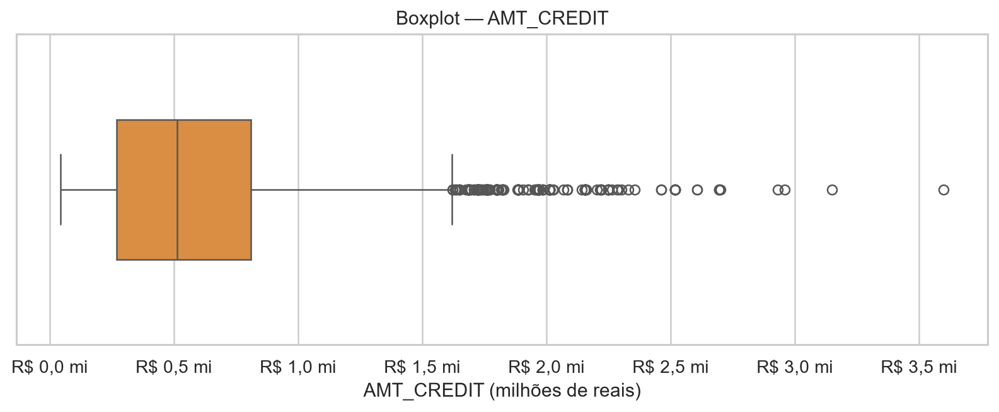

Fonte: elaborado pelos autores a partir da amostra de 10.000 registros.

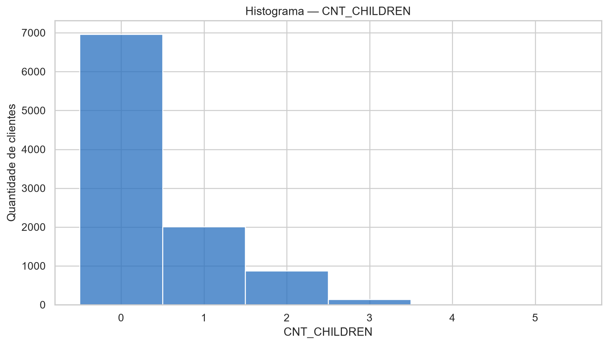

Fonte: elaborado pelos autores a partir da amostra de 10.000 registros.

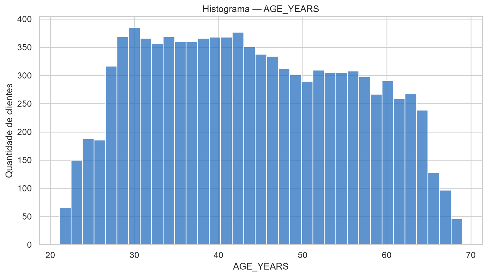

Fonte: elaborado pelos autores a partir da amostra de 10.000 registros.

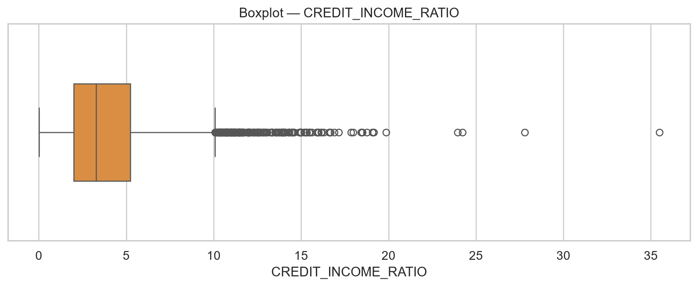

Fonte: elaborado pelos autores a partir da amostra de 10.000 registros.

# 7 PESOS E TRANSFORMAÇÕES

O preparo reproduziu a lógica do `p1.py`. Peso zero excluiria um atributo; nenhum dos seis aprovados recebeu zero. Para cada atributo numérico, aplicou-se Min-Max e, em seguida, multiplicação por `sqrt(peso)`. A diferença é elevada ao quadrado na distância euclidiana; portanto, a raiz quadrada faz com que o efeito final corresponda ao peso inteiro.

Formalmente, para um atributo numérico `x`, foi utilizada a transformação `x' = ((x - min(x)) / (max(x) - min(x))) * sqrt(peso)`. Para `FLAG_OWN_CAR_COD`, o dicionário do Trabalho 1 associa `0` a `N` e `1` a `Y`. O preparo recuperou esses rótulos e preservou o atributo como nominal, sem multiplicação; peso 1 significa apenas sua inclusão. Na distância nominal do WEKA, categorias iguais contribuem com zero e categorias diferentes com uma unidade. Nas métricas Python posteriores, `N/Y` foi codificado temporariamente como `0/1`, produzindo a mesma contribuição unitária, sem alterar os arquivos exportados.

Embora houvesse regras de imputação por mediana e moda, nenhum valor dos seis campos precisou ser alterado. A base final manteve 10.000 registros, a mesma ordem e somente os atributos aprovados. `SK_ID_CURR`, `TARGET` e `ROW_ID_AMOSTRA` ficaram fora do arquivo destinado ao WEKA.

# 8 ESTATÍSTICA DE HOPKINS

A Estatística de Hopkins verifica se a distribuição se afasta de um padrão aproximadamente uniforme. A implementação própria preservou a fórmula e a distância do `p2.py`, mas tornou toda a aleatoriedade explícita com `numpy.random.default_rng(42)`: seleção dos pontos reais, geração uniforme dos valores numéricos e escolha das categorias nominais. Foram usados 100 registros reais e 100 virtuais, equivalentes a 1% da base de 10.000 registros.

| Tentativa | Hopkins | Lim. | Amostra real | Amostra virtual | Decisão |
|---:|---:|---:|---:|---:|---|
| 1 | 0,941745479089 | 0,70 | 100 | 100 | Aprovada para o WEKA |

Fonte: elaborado pelos autores a partir de `hopkins_tentativa_01.csv`.

As duas execuções independentes produziram `0,941745479089317`, com diferença absoluta zero, e ficaram acima do limiar definido no enunciado. Por isso, não houve manipulação posterior dos pesos nem novas tentativas. O valor indica forte tendência de agrupamento para a representação escolhida, mas não determina quantidade de clusters nem garante utilidade comercial.

# 9 DESCRIÇÃO DO DBSCAN

DBSCAN é um método baseado em densidade que expande regiões com quantidade suficiente de vizinhos e marca pontos de baixa densidade como ruído (ESTER et al., 1996). Seus principais parâmetros são `epsilon`, que define o raio de vizinhança, e `minPoints`, que define a densidade mínima.

O método pode identificar grupos de forma arbitrária e não exige que o número de clusters seja informado previamente. Em contrapartida, é sensível à escala e aos parâmetros de densidade. Neste trabalho, a escala e os pesos foram definidos antes do WEKA, e a normalização interna da distância foi desativada.

# 10 DESCRIÇÃO DO SIMPLEKMEANS

O K-Means particiona os registros em `K` grupos e procura reduzir a soma das distâncias quadráticas aos centroides (MACQUEEN, 1967). Cada iteração alterna atribuição dos pontos ao centro mais próximo e atualização dos centros.

O método é simples, eficiente e produz grupos diretamente utilizáveis, mas depende de `K`, da inicialização e da geometria euclidiana. O SimpleKMeans foi testado com `K=8`, `K=9` e `K=10`. A solução com nove grupos foi escolhida como compromisso: obteve a maior Silhouette dos três testes, manteve alta entropia dos tamanhos e permitiu comparação direta com os nove grupos densos do DBSCAN. A escolha não representa um `K` perfeito, e a estabilidade fora desta amostra não foi testada.

# 11 DESCRIÇÃO DO EM

O algoritmo Expectation-Maximization estima parâmetros de modelos probabilísticos com variáveis latentes por etapas alternadas de expectativa e maximização (DEMPSTER; LAIRD; RUBIN, 1977). Na clusterização, cada grupo pode ser representado como componente de uma mistura probabilística.

Embora o EM produza probabilidades de pertencimento internamente, o filtro `AddCluster` exportou um rótulo rígido por registro. As avaliações posteriores usam esses rótulos. Foram testadas configurações com 8, 9 e 10 grupos; nove foi selecionado pelo maior log-likelihood registrado entre K=8 e K=9 e pela comparabilidade com os demais métodos. O valor anômalo registrado para K=10 não pode ser tratado como evidência conclusiva porque a saída textual bruta do WEKA não foi preservada.

# 12 CONFIGURAÇÕES UTILIZADAS

As execuções foram realizadas no WEKA 3.8.7 com o filtro `weka.filters.unsupervised.attribute.AddCluster`. Para DBSCAN foi usado o pacote oficial `optics_dbScan` 1.0.6. A distância foi `weka.core.EuclideanDistance -R first-last -D`; a opção `-D` desativou a normalização interna e preservou os pesos já aplicados.

| DBSCAN | `epsilon` | `minPoints` | Clusters | Ruídos | Tempo (s) |
|---|---:|---:|---:|---:|---:|
| Teste 1 | 0,2500 | 6 | 9 | 396 | 7,805 |
| Teste 2 - escolhido | 0,2743 | 6 | 9 | 296 | 7,740 |
| Teste 3 | 0,3000 | 6 | 9 | 217 | 6,491 |

Fonte: elaborado pelos autores a partir de `configuracoes_dbscan.csv`.

O valor completo do teste escolhido, `0,274264329676`, foi reproduzido como o joelho geométrico da curva ordenada de distância ao sexto vizinho: maior afastamento entre a curva normalizada e a reta que liga seus extremos, no percentil 94,38%. A evidência completa foi preservada em `resultados/validacao_final/k_distance_dbscan.csv` e `relatorio/imagens/clusters/k_distance_dbscan.png`. O teste 2 foi escolhido pelo critério geométrico objetivo; os valores 0,25 e 0,30 documentam a sensibilidade, reduzindo os ruídos de 396 para 217 sem alterar os nove clusters, e não foram escolhidos apenas por minimizarem ruído.

| SimpleKMeans | Seed | Iterações | SSE | Tempo (s) | Selecionado |
|---:|---:|---:|---:|---:|---|
| K=8 | 42 | 37 | 2.386,976060 | 1,816 | Não |
| K=9 | 42 | 62 | 2.284,489341 | 1,255 | Sim |
| K=10 | 42 | 57 | 2.172,711624 | 1,149 | Não |

Fonte: elaborado pelos autores a partir de `configuracoes_kmeans.csv`.

| EM | Seed | Máx. iterações | Log-likelihood | Tempo (s) | Selecionado |
|---:|---:|---:|---:|---:|---|
| K=8 | 42 | 100 | 2,54478 | 2,786 | Não |
| K=9 | 42 | 100 | 2,56187 | 3,300 | Sim |
| K=10 | 42 | 100 | -0,29589 | 3,394 | Não |

Fonte: elaborado pelos autores a partir de `configuracoes_em.csv`.

Os tempos, iterações, SSE e log-likelihood desta seção são transcrições registradas durante o uso do WEKA. As relações dos ARFFs comprovam o `AddCluster`, o algoritmo, a semente e os parâmetros, mas os logs textuais completos da interface não foram preservados. Em particular, o log-likelihood de K=10 (`-0,29589`) permanece não comprovado de forma independente e deve ser conferido pelos integrantes no WEKA antes da entrega, sem substituir o valor por estimativa.

# 13 RESULTADOS DO DBSCAN

A configuração selecionada encontrou nove clusters e 296 ruídos, equivalentes a 2,96% da amostra. O maior grupo reuniu 4.759 registros, enquanto o menor teve seis. A forte desigualdade de tamanhos, com razão 793,17 entre maior e menor, mostra que o método isolou microgrupos de combinações raras.

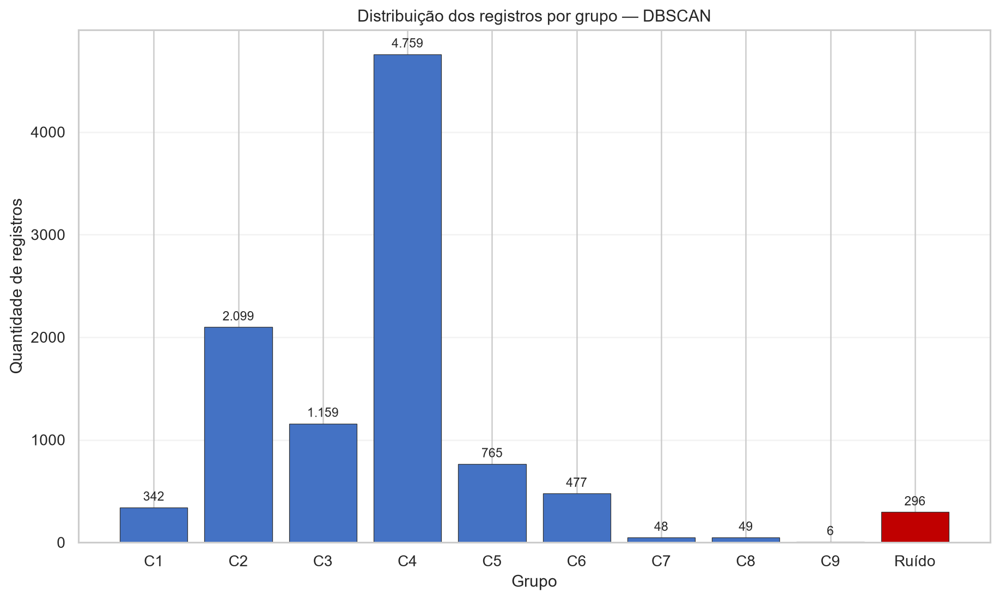

Fonte: elaborado pelos autores a partir da exportação real do WEKA.

Os grupos mais nítidos combinaram quantidade de filhos e posse de carro. O `cluster2`, com 2.099 registros, reuniu clientes sem filhos e com carro; o `cluster4`, com 4.759, reuniu clientes sem filhos e sem carro; `cluster3` e `cluster6` reuniram clientes com um e dois filhos, respectivamente, sem carro. Os microgrupos 7, 8 e 9 tiveram 48, 49 e seis registros.

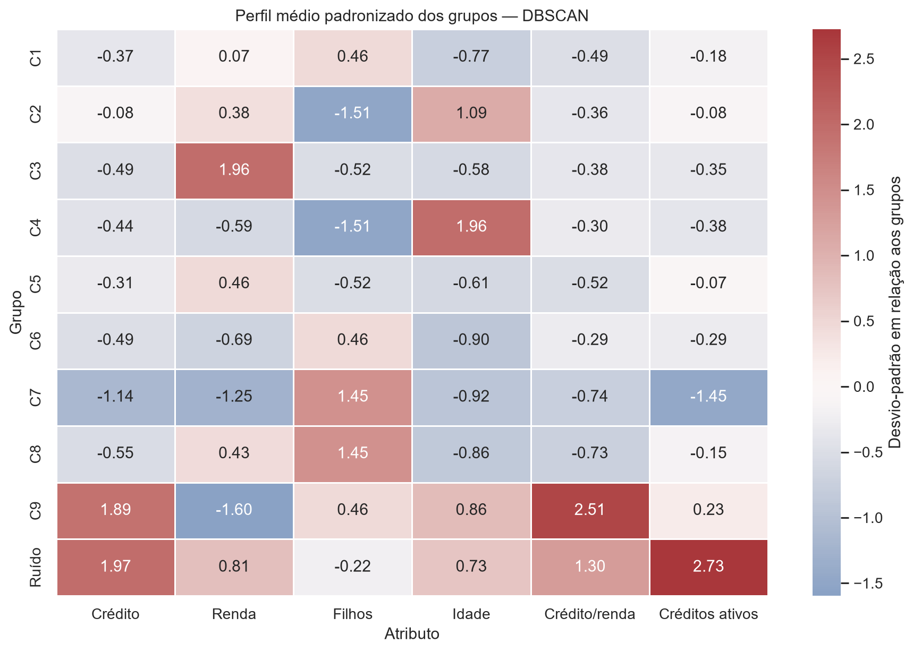

Fonte: elaborado pelos autores a partir das bases mescladas da Etapa 11.

Os ruídos apresentaram crédito médio de R$ 1.288.126, relação crédito/renda de 8,02, 3,49 créditos ativos e dívida atrasada média de R$ 782,92. Esses registros merecem investigação individual, mas ruído geométrico não significa fraude ou inadimplência.

# 14 RESULTADOS DO K-MEANS

O SimpleKMeans selecionado produziu nove grupos entre 525 e 1.992 registros. A distribuição foi mais equilibrada que as soluções de DBSCAN e EM, com entropia normalizada de tamanhos igual a 0,960189.

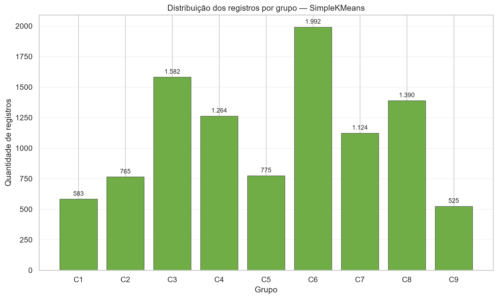

Fonte: elaborado pelos autores a partir da exportação real do WEKA.

Entre os perfis, o `cluster7` reuniu 1.124 clientes jovens, idade média de 29,83 anos e sem carro. O `cluster1` reuniu 583 clientes com 2,19 filhos em média e apenas 0,69% de posse de carro. O `cluster8` reuniu 1.390 clientes, todos com carro, idade média de 52,69 anos e crédito médio de R$ 760.528. O `cluster9` destacou 5,23 créditos ativos em média.

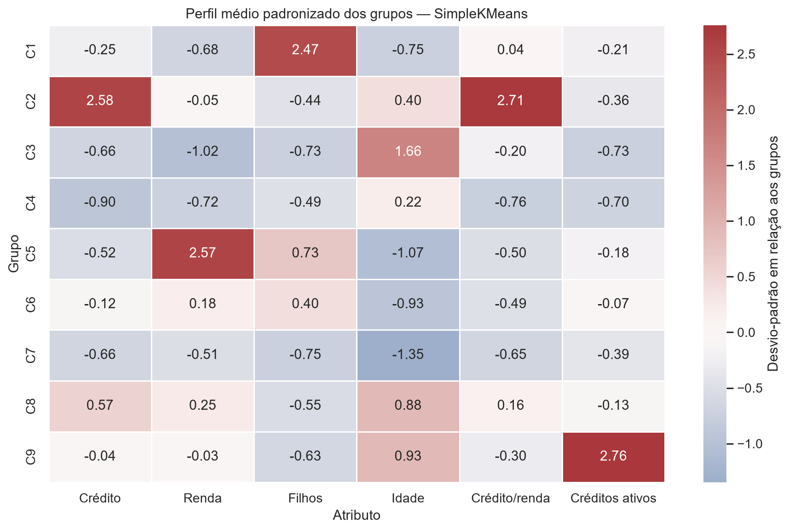

Fonte: elaborado pelos autores a partir das bases mescladas da Etapa 11.

O método apresentou Silhouette de 0,263382, Davies-Bouldin de 1,380971 e Calinski-Harabasz de 3.106,870163. Entre os testes de K-Means, K=8 obteve Silhouette 0,261108, Davies-Bouldin 1,434865, Calinski-Harabasz 3.337,257175 e entropia 0,965779; K=9 obteve 0,263382, 1,380971, 3.106,870163 e 0,960189; K=10 obteve 0,260893, 1,291130, 2.960,828158 e 0,957484. Assim, K=9 liderou em Silhouette, K=10 em Davies-Bouldin e K=8 em Calinski-Harabasz e equilíbrio. A solução final é um compromisso entre esses resultados, interpretabilidade e comparabilidade, não uma escolha baseada somente no DBSCAN.

# 15 RESULTADOS DO EM

O EM selecionado produziu nove grupos, mas concentrou 4.359 registros no `cluster3`, correspondentes a 43,59% da amostra. O menor grupo teve 257 registros e a entropia normalizada de tamanhos foi 0,809238.

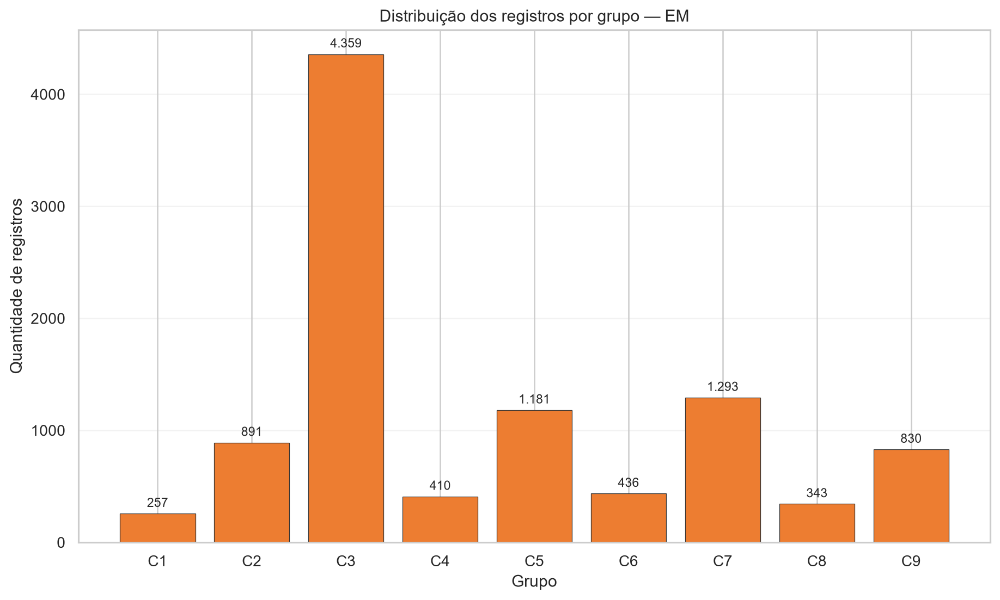

Fonte: elaborado pelos autores a partir da exportação real do WEKA.

O `cluster7` confirmou um perfil jovem e sem carro, com 1.293 clientes e idade média de 29,15 anos. O `cluster5` reuniu 1.181 clientes com 1,59 filho em média e sem carro. Os clusters 4 e 8 apresentaram crédito médio superior a R$ 1,3 milhão e relação crédito/renda de 7,95 e 9,22.

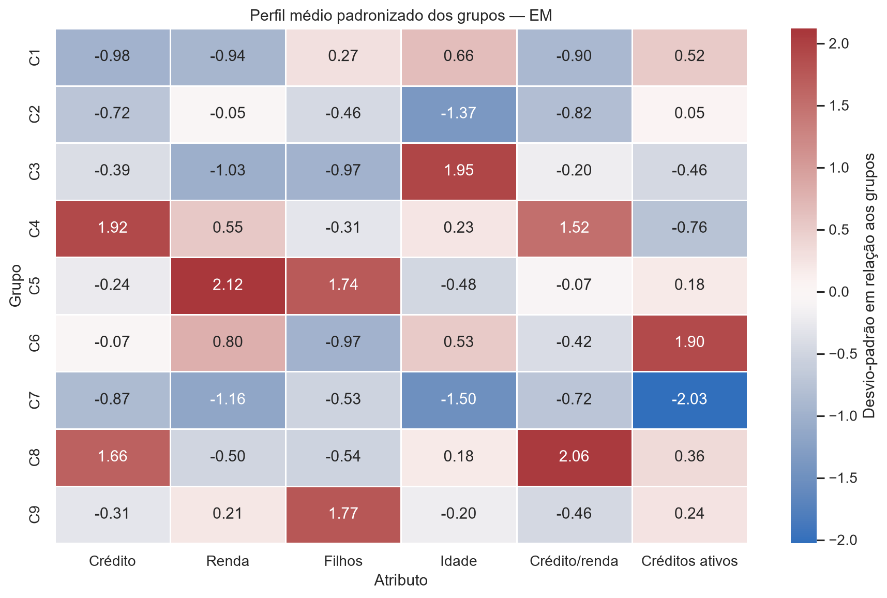

Fonte: elaborado pelos autores a partir das bases mescladas da Etapa 11.

As métricas do EM final foram Silhouette 0,109936, Davies-Bouldin 1,504642 e Calinski-Harabasz 1.862,177065. Nos testes, K=8 obteve respectivamente 0,123620, 1,525789 e 1.989,783051, com entropia 0,821489; K=9 obteve 0,109936, 1,504642 e 1.862,177065, com entropia 0,809238; K=10 obteve 0,224511, 1,385751 e 2.659,300779, com entropia 0,972261. As atribuições de K=10 são geometricamente avaliáveis, mas a comparação probabilística permanece inconclusiva devido ao log-likelihood anômalo sem log bruto. A concentração de K=9 no `cluster3` reduz a utilidade operacional dos nove rótulos para campanhas diretas.

# 16 COMPARAÇÃO DOS MÉTODOS

As métricas foram calculadas sobre os seis atributos transformados. A Silhouette usou amostra reproduzível de 3.000 registros com semente 42 (ROUSSEEUW, 1987). Davies-Bouldin e Calinski-Harabasz foram calculados com todos os rótulos válidos (DAVIES; BOULDIN, 1979; CALINSKI; HARABASZ, 1974). Para DBSCAN, os 296 ruídos foram excluídos somente das métricas geométricas.

| Método | Silhouette | Davies-Bouldin | Calinski-Harabasz | Menor grupo | Maior grupo | Ruídos |
|---|---:|---:|---:|---:|---:|---:|
| DBSCAN | 0,085904 | 1,855622 | 1.031,784 | 6 | 4.759 | 296 |
| SimpleKMeans | 0,263382 | 1,380971 | 3.106,870 | 525 | 1.992 | 0 |
| EM | 0,109936 | 1,504642 | 1.862,177 | 257 | 4.359 | 0 |

Fonte: elaborado pelos autores a partir de `comparativo_metodos.csv`.

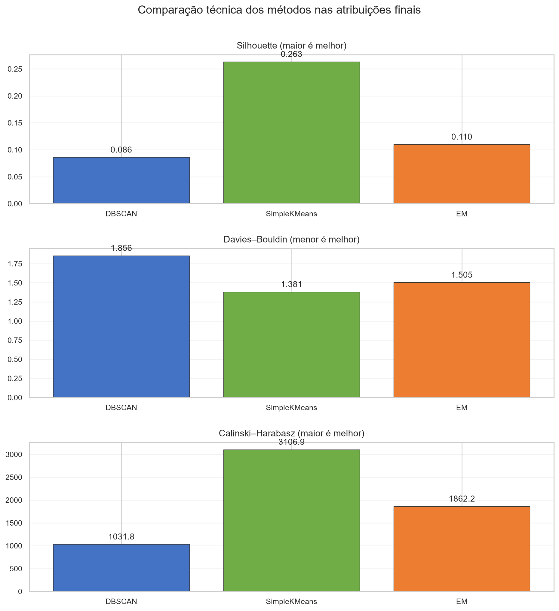

Fonte: elaborado pelos autores a partir das três bases clusterizadas.

SimpleKMeans apresentou o melhor resultado relativo nas métricas internas avaliadas entre as três soluções finais e grupos mais equilibrados. DBSCAN teve vantagem ao isolar ruídos e combinações raras. EM confirmou parte dos padrões, mas gerou um grupo dominante. A escolha não deve se basear apenas em quantidade de clusters: compactação, separação, densidade, tamanho e interpretação precisam ser considerados conjuntamente; estabilidade é uma limitação, pois não foi medida em nova amostra.

# 17 PERFIS IDENTIFICADOS

A taxa global posterior de `TARGET=1` foi 8,23%. Essa variável não participou do agrupamento e serve somente para descrição.

| Perfil recorrente | Evidências reais | Leitura |
|---|---|---|
| Jovens sem carro | K-Means C7: 1.124 clientes, 29,83 anos, `TARGET=1` 12,72%; EM C7: 1.293, 29,15 anos, 12,99% | Crédito de entrada e mobilidade com cautela |
| Famílias com filhos sem carro | DBSCAN C6: 477 e 2 filhos; K-Means C1: 583 e 2,19 filhos; EM C5: 1.181 e 1,59 filho | Mobilidade familiar e crédito para despesas familiares |
| Crédito alto e forte comprometimento | K-Means C2 e EM C4/C8: crédito acima de R$ 1,2 milhão e relação próxima ou superior a 8 | Revisão de limites, refinanciamento e portabilidade |
| Clientes maduros | K-Means C3/C8 e EM C3: 52,69 a 60,63 anos, `TARGET=1` entre 5,31% e 6,49% | Relacionamento e produtos adequados ao estágio de vida |
| Muitos créditos ativos | K-Means C9: 525 clientes, 5,23 créditos ativos e `TARGET=1` 9,71% | Consolidação, renegociação e prevenção de sobre-endividamento |
| Casos fora do padrão | DBSCAN: 296 ruídos, 3,49 créditos ativos e relação 8,02 | Análise individual e verificação de dados |

Fonte: elaborado pelos autores a partir dos resumos de clusters.

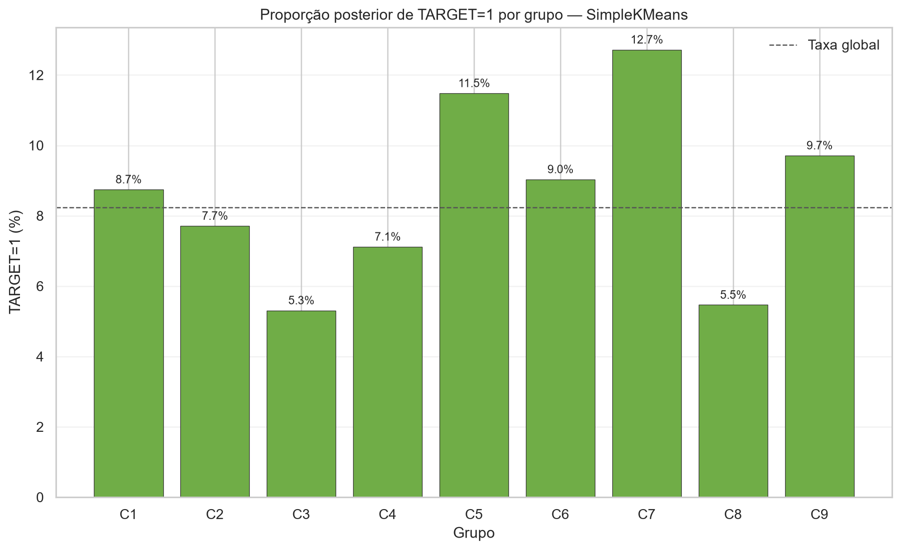

Fonte: elaborado pelos autores; `TARGET` não participou da clusterização.

# 18 APLICAÇÕES COMERCIAIS

Os perfis de jovens sem carro e famílias com filhos sem carro foram confirmados por mais de um método e são as hipóteses mais consistentes. Podem apoiar testes de financiamento de veículo popular ou seminovo, mobilidade acessível, crédito familiar e parcerias com revendas. Ausência de carro, entretanto, não comprova intenção de compra.

Clientes que já possuem carro podem receber comunicação distinta: seguro, manutenção, troca, refinanciamento ou serviços associados. Grupos com crédito alto e relação crédito/renda elevada podem ser relevantes para portabilidade ou revisão de relacionamento, mas não devem receber nova oferta sem avaliação de capacidade de pagamento.

O grupo com muitos créditos ativos e os ruídos do DBSCAN são mais compatíveis com renegociação, consolidação e análise individual do que com concessão agressiva. As campanhas devem ser testadas de forma controlada e acompanhadas por conversão, inadimplência, retorno e estabilidade fora da amostra.

# 19 LIMITAÇÕES

- A amostra de 10.000 registros é reproduzível, mas representa apenas parte dos 307.511 clientes.
- A Estatística de Hopkins depende da representação, dos atributos e dos pesos escolhidos.
- Min-Max é sensível a extremos, mesmo com pesos controlados.
- A posse de carro é nominal e foi codificada como diferença entre `N` e `Y` apenas para cálculo das métricas posteriores.
- A Silhouette foi estimada com 3.000 registros para evitar custo quadrático completo.
- As métricas de DBSCAN excluem ruídos, enquanto os resumos comerciais os preservam.
- A avaliação do EM usa rótulos rígidos exportados, não as probabilidades internas.
- Microgrupos de 48, 49 e seis registros não sustentam campanhas amplas.
- `TARGET` é posterior e não permite inferir causalidade.
- Estado civil, idade e composição familiar não devem ser usados de maneira discriminatória.
- Não foi realizado teste temporal ou em nova amostra para medir estabilidade.
- As saídas textuais brutas do WEKA não foram preservadas; os ARFFs comprovam as configurações e atribuições, mas não permitem revalidar avisos, convergência, tempos e diagnósticos exibidos na interface.

# 20 CONCLUSÃO

O trabalho construiu uma pipeline completa e rastreável de clusterização a partir da base do Trabalho 1. A amostra de 10.000 registros foi criada com semente 42; seis atributos interpretáveis foram transformados com pesos explícitos; a Estatística de Hopkins atingiu 0,941745; e três métodos foram executados realmente no WEKA pelo filtro `AddCluster`.

SimpleKMeans apresentou o melhor resultado relativo nas métricas internas avaliadas e os grupos mais equilibrados entre as soluções finais. DBSCAN contribuiu ao identificar ruídos e combinações raras. EM confirmou perfis importantes, embora tenha concentrado 43,59% da amostra em um único grupo. A comparação mostra que os algoritmos fornecem visões complementares.

Foram encontrados perfis de jovens sem carro, famílias com filhos sem carro, clientes maduros, clientes de crédito elevado, clientes com muitos contratos ativos e casos fora do padrão. As interpretações apoiam hipóteses comerciais, mas exigem validação adicional antes de qualquer decisão real de crédito.

# 21 REFERÊNCIAS

CALIŃSKI, T.; HARABASZ, J. A dendrite method for cluster analysis. *Communications in Statistics*, v. 3, n. 1, p. 1-27, 1974. DOI: 10.1080/03610927408827101.

DAVIES, D. L.; BOULDIN, D. W. A cluster separation measure. *IEEE Transactions on Pattern Analysis and Machine Intelligence*, v. 1, n. 2, p. 224-227, 1979. DOI: 10.1109/TPAMI.1979.4766909.

DEMPSTER, A. P.; LAIRD, N. M.; RUBIN, D. B. Maximum likelihood from incomplete data via the EM algorithm. *Journal of the Royal Statistical Society: Series B*, v. 39, n. 1, p. 1-22, 1977. DOI: 10.1111/j.2517-6161.1977.tb01600.x.

ESTER, M.; KRIEGEL, H.-P.; SANDER, J.; XU, X. A density-based algorithm for discovering clusters in large spatial databases with noise. In: *Proceedings of the Second International Conference on Knowledge Discovery and Data Mining*. Portland: AAAI Press, 1996. p. 226-231.

HALL, M. et al. The WEKA data mining software: an update. *SIGKDD Explorations*, v. 11, n. 1, p. 10-18, 2009. DOI: 10.1145/1656274.1656278.

HOPKINS, B.; SKELLAM, J. G. A new method for determining the type of distribution of plant individuals. *Annals of Botany*, v. 18, n. 2, p. 213-227, 1954. DOI: 10.1093/oxfordjournals.aob.a083391.

MACQUEEN, J. Some methods for classification and analysis of multivariate observations. In: *Proceedings of the Fifth Berkeley Symposium on Mathematical Statistics and Probability*. Berkeley: University of California Press, 1967. v. 1, p. 281-297.

PEDREGOSA, F. et al. Scikit-learn: machine learning in Python. *Journal of Machine Learning Research*, v. 12, n. 85, p. 2825-2830, 2011. Disponível em: https://www.jmlr.org/papers/v12/pedregosa11a.html. Acesso em: 21 jul. 2026.

ROUSSEEUW, P. J. Silhouettes: a graphical aid to the interpretation and validation of cluster analysis. *Journal of Computational and Applied Mathematics*, v. 20, p. 53-65, 1987. DOI: 10.1016/0377-0427(87)90125-7.

UNIVERSIDADE FEDERAL DE UBERLÂNDIA. *Trabalho Prático 1 de Ciência de Dados: base final pré-processada*. Monte Carmelo, 2026. Base de dados e documentação internas do projeto.

UNIVERSIDADE FEDERAL DE UBERLÂNDIA. *p1.py e p2.py: scripts didáticos para preparação ponderada e Estatística de Hopkins*. Monte Carmelo, 2026. Material fornecido na disciplina de Ciência de Dados.

UNIVERSITY OF WAIKATO. *AddCluster: WEKA API documentation*. Hamilton, 2026. Disponível em: https://weka.sourceforge.io/doc.stable/weka/filters/unsupervised/attribute/AddCluster.html. Acesso em: 21 jul. 2026.

UNIVERSITY OF WAIKATO. *optics_dbScan: the OPTICS and DBSCAN clustering algorithms*. Versão 1.0.6. Hamilton, 2026. Disponível em: https://weka.sourceforge.io/packageMetaData/optics_dbScan/index.html. Acesso em: 21 jul. 2026.

# 22 APÊNDICE A - ARQUIVOS E RASTREABILIDADE

Os principais artefatos são:

- `data/amostras/base_amostra_10000_completa.csv`;
- `data/amostras/base_amostra_10000_analise.csv`;
- `data/preparadas/base_clusterizacao_final.csv`;
- `data/preparadas/base_clusterizacao_final.arff`;
- `data/clusterizadas_weka/base_clusterizada_dbscan.arff`;
- `data/clusterizadas_weka/base_clusterizada_dbscan.csv`;
- `data/clusterizadas_weka/base_clusterizada_kmeans_final.csv`;
- `data/clusterizadas_weka/base_clusterizada_em_final.csv`;
- `data/analise/analise_cluster_dbscan.csv`;
- `data/analise/analise_cluster_kmeans.csv`;
- `data/analise/analise_cluster_em.csv`.

As exportações foram validadas com 10.000 registros e sete colunas no total: seis atributos de entrada e uma coluna `cluster`. Os seis atributos de entrada foram comparados integralmente com a base preparada. A ordem e os valores permaneceram inalterados. Os valores transformados foram adicionados à base auxiliar com sufixo `_TRANSFORMADO`, sem substituir as colunas originais.

O ARFF `base_clusterizada_dbscan.arff` é a exportação original do AddCluster. O CSV de mesmo nome foi gerado somente na validação final como conversão tabular fiel desse ARFF, preservando as 10.000 linhas, os seis atributos, os rótulos e os 296 ruídos; ele não é apresentado como nova execução do WEKA.

# 23 APÊNDICE B - CONFIGURAÇÕES COMPLETAS

DBSCAN selecionado: `epsilon=0,274264329676`, `minPoints=6`, distância euclidiana com `-D`, nove clusters, 296 ruídos e tempo de 7,739836 segundos.

SimpleKMeans selecionado: `K=9`, semente 42, inicialização aleatória `init=0`, máximo de 500 iterações, 62 iterações executadas, uma thread, SSE 2.284,489341365910 e tempo do `AddCluster` de 1,254532 segundos.

EM selecionado: nove clusters, semente 42, máximo de 100 iterações, dez inicializações K-Means internas, desvio padrão mínimo `1e-6`, uma thread, log-likelihood 2,56187 e tempo de 3,300190 segundos.

# 24 APÊNDICE C - BASES ANEXADAS

A entrega deve acompanhar as bases relativas às três clusterizações finais e a base preparada usada no WEKA. As bases clusterizadas mantêm os 10.000 registros e a coluna `cluster` realmente exportada pelo filtro `AddCluster`.

Para análise, foram gerados `analise_cluster_dbscan.csv`, `analise_cluster_kmeans.csv` e `analise_cluster_em.csv`, cada um com 10.000 linhas e 49 colunas. Esses arquivos incluem `ROW_ID_AMOSTRA`, `SK_ID_CURR`, `TARGET`, atributos originais, atributos transformados e o cluster. `TARGET` aparece somente nessa camada posterior.

Os scripts `p1.py`, `p2.py` e os scripts próprios numerados de `02` a `13` documentam a pipeline; a Etapa 0 consistiu em auditoria sem criação de script. Configurações, resultados de Hopkins, validações, resumos e gráficos permanecem organizados nas pastas `resultados/`, `docs/` e `relatorio/imagens/`.
