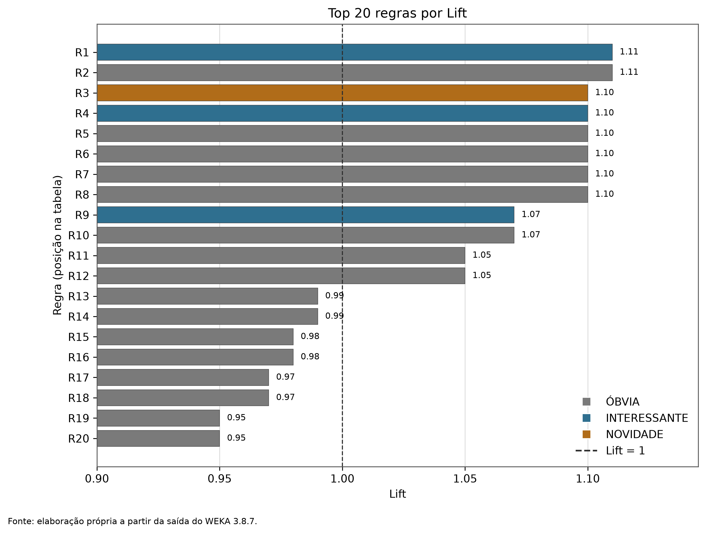
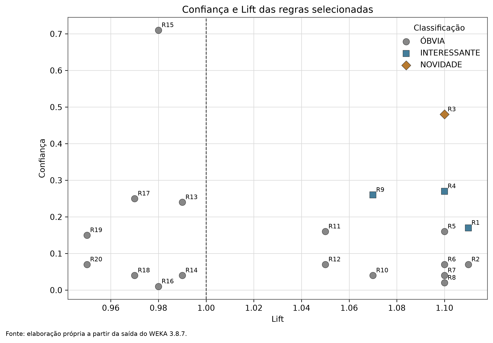
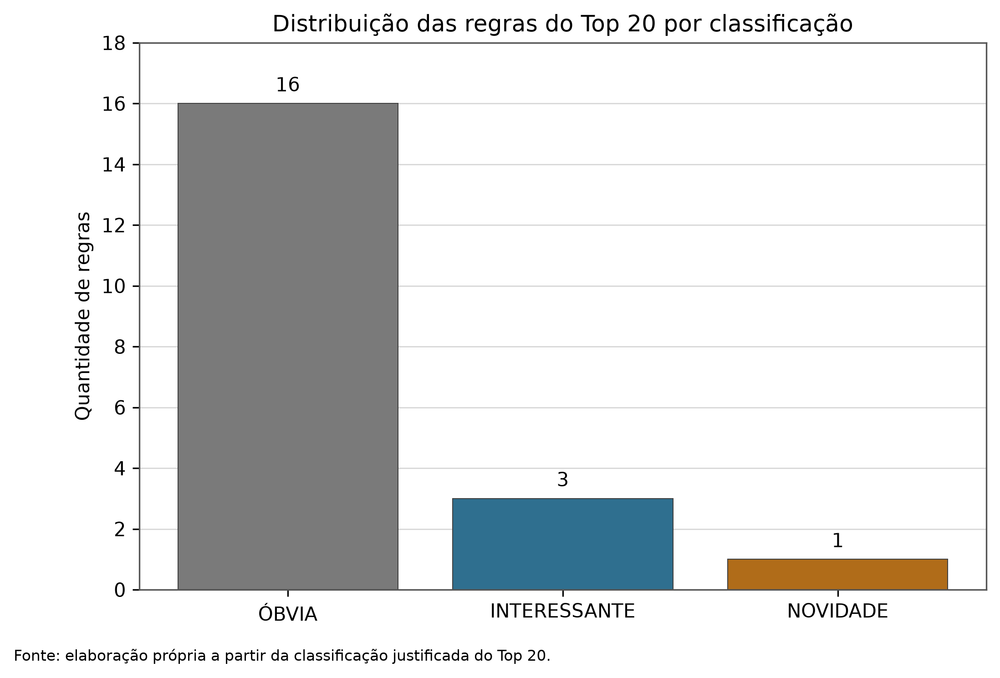
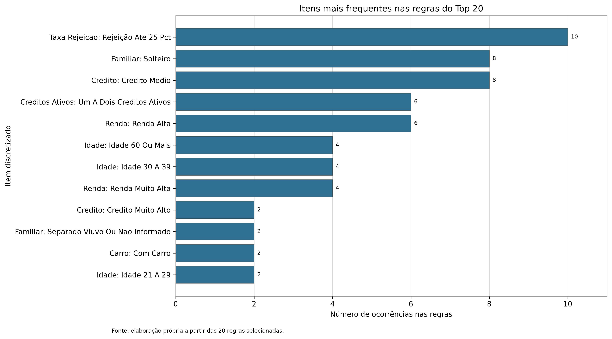

# UNIVERSIDADE FEDERAL DE UBERLÂNDIA

## FACULDADE DE COMPUTAÇÃO

# TRABALHO PRÁTICO DE CIÊNCIA DE DADOS

## REGRAS DE ASSOCIAÇÃO APRIORI

Gil Antony Borba; Raphael Muniz Varela; Victor Leal; Ygor Marangoni  
Monte Carmelo - MG, 2026

---

# FOLHA DE ROSTO

Trabalho Prático de Ciência de Dados - Regras de Associação Apriori.

Gil Antony Borba; Raphael Muniz Varela; Victor Leal; Ygor Marangoni. Trabalho apresentado à disciplina de Ciência de Dados da Universidade Federal de Uberlândia, como requisito parcial de avaliação. Professor: Carlos Cesar Mansur Tuma.

---

# SUMÁRIO

O sumário automático será atualizado no Microsoft Word durante a preparação final do arquivo.

# 1 Introdução

Este relatório apresenta a mineração de regras de associação Apriori sobre uma amostra reproduzível de clientes. O propósito é descrever coocorrências entre características, não prever TARGET e não atribuir causalidade. Todas as quantidades apresentadas foram extraídas de arquivos preservados no repositório.

# 2 Descrição do problema

O enunciado exige discretizar atributos, executar Apriori no WEKA, preservar itemsets, construir o conjunto fechado, ordenar regras por Lift e interpretar vinte regras. TARGET, SK_ID_CURR e ROW_ID_AMOSTRA foram excluídos da mineração.

# 3 Contexto dos trabalhos anteriores

O Trabalho 1 produziu a base final pré-processada com 307.511 registros e 41 colunas. O Trabalho 3 gerou a amostra analítica reproduzível de 10.000 registros. A base ponderada de clusterização não foi usada, porque contém transformações e pesos específicos daquele trabalho.

# 4 Descrição da base

A origem aprovada é trabalho_3_clusterizacao/data/amostras/base_amostra_10000_analise.csv. Ela contém valores originais não ponderados e mantém identificadores apenas para rastreabilidade. A representação Apriori final usa 10.000 transações e oito dimensões conceituais.

# 5 Escolha da amostra

A amostra do Trabalho 3 foi escolhida por ser reproduzível, possuir 10.000 linhas e não conter Min-Max, raiz de peso ou peso de clusterização. A comparação de linhas confirmou que ela preserva valores de origem antes da ponderação.

# 6 Auditoria dos atributos

Foram auditados 13 candidatos quanto a tipo, distribuição, quantis, ausências, zeros, assimetria, concentração e outliers. A seleção buscou interpretação, diversidade e frequência suficiente, evitando categorias extremamente raras.

# 7 Seleção dos oito atributos

Foram selecionados crédito, renda, idade, filhos, posse de carro, situação familiar, créditos ativos e taxa de rejeição prévia. As dimensões combinam perfil demográfico, familiar e financeiro, sem incluir o alvo ou identificadores.

| Dimensão | Representação |
|---|---|
| FAIXA_CREDITO | quatro faixas |
| FAIXA_RENDA | quatro faixas |
| FAIXA_IDADE | cinco faixas |
| CATEGORIA_FILHOS | três categorias |
| POSSE_CARRO | com/sem carro |
| SITUACAO_FAMILIAR | três grupos |
| FAIXA_CREDITOS_ATIVOS | três faixas |
| FAIXA_TAXA_REJEICAO | três faixas |

# 8 Atributos descartados e motivos

CREDIT_INCOME_RATIO foi descartado por redundância matemática quando crédito e renda já estão presentes. SER_DIVIDA_ATRASADA foi descartado pela concentração próxima de 98,8% em zero. SER_QTDE_EMPRESTIMOS, PREV_QTDE_TENTATIVAS e o candidato remanescente não foram selecionados para preservar diversidade e limitar a oito dimensões.

# 9 Análise da distribuição

As faixas foram definidas por percentis, quartis, semântica e tamanho de categoria. A validação evitou classes abaixo de 5%, reduzindo a chance de regras artificiais sustentadas por poucos registros.

# 10 Processo de discretização

As oito variáveis foram convertidas em categorias interpretáveis. Variáveis monetárias receberam quatro faixas; idade recebeu cinco grupos; filhos, carro, situação familiar, créditos ativos e rejeição receberam categorias semanticamente nomeadas.

# 11 Justificativa individual das faixas

Crédito e renda usam cortes robustos à presença de extremos. Idade usa intervalos interpretáveis. Filhos separa sem filhos, um filho e dois ou mais. Categorias financeiras distinguem ausência, intensidade moderada e intensidade maior sem deixar o zero numérico como valor de negócio.

| Atributo | Categoria | Limite inferior | Limite superior |
|---|---|---|---|
| AMT_CREDIT | CREDITO_BAIXO |  |  |
| AMT_CREDIT | CREDITO_MEDIO |  |  |
| AMT_CREDIT | CREDITO_ALTO |  |  |
| AMT_CREDIT | CREDITO_MUITO_ALTO |  |  |
| AMT_INCOME_TOTAL | RENDA_BAIXA |  |  |
| AMT_INCOME_TOTAL | RENDA_MEDIA |  |  |
| AMT_INCOME_TOTAL | RENDA_ALTA |  |  |
| AMT_INCOME_TOTAL | RENDA_MUITO_ALTA |  |  |
| AGE_YEARS | IDADE_21_A_29 |  |  |
| AGE_YEARS | IDADE_30_A_39 |  |  |
| AGE_YEARS | IDADE_40_A_49 |  |  |
| AGE_YEARS | IDADE_50_A_59 |  |  |
| AGE_YEARS | IDADE_60_OU_MAIS |  |  |
| CNT_CHILDREN | SEM_FILHOS |  |  |
| CNT_CHILDREN | UM_FILHO |  |  |
| CNT_CHILDREN | DOIS_OU_MAIS_FILHOS |  |  |
| FLAG_OWN_CAR_COD | SEM_CARRO |  |  |
| FLAG_OWN_CAR_COD | COM_CARRO |  |  |
| NAME_FAMILY_STATUS_COD | CASADO_OU_UNIAO_CIVIL |  |  |
| NAME_FAMILY_STATUS_COD | SOLTEIRO |  |  |
| NAME_FAMILY_STATUS_COD | SEPARADO_VIUVO_OU_NAO_INFORMADO |  |  |
| SER_CREDITOS_ATIVOS | SEM_CREDITOS_ATIVOS |  |  |
| SER_CREDITOS_ATIVOS | UM_A_DOIS_CREDITOS_ATIVOS |  |  |
| SER_CREDITOS_ATIVOS | TRES_OU_MAIS_CREDITOS_ATIVOS |  |  |
| PREV_TAXA_REJEICAO | SEM_REJEICAO_PREVIA |  |  |
| PREV_TAXA_REJEICAO | REJEICAO_PREVIA_ATE_25_PCT |  |  |
| PREV_TAXA_REJEICAO | REJEICAO_PREVIA_ACIMA_25_PCT |  |  |

# 12 Problema de treatZeroAsMissing

A auditoria do WEKA 3.8.7 confirmou que -Z trata o primeiro valor nominal como ausente, e não o texto zero. Portanto, o ARFF nominal multivalorado não foi minerado com -Z, pois isso eliminaria categorias reais.

# 13 Tratamento dos zeros semânticos

Foi criada uma representação one-hot com 27 atributos {0,1}. Em cada coluna, 0 significa item ausente e 1 item presente. Assim, -Z ignora somente ausências. Cada transação possui exatamente oito valores 1, um por dimensão original.

# 14 Geração da base final

A base semântica discretizada foi preservada sem alteração. A base técnica binária tem 10.000 linhas, 27 itens e nenhuma coluna de TARGET, identificador, cluster ou peso. As frequências binárias foram confrontadas com as frequências nominais.

# 15 Validação das categorias

Foram validados 27 itens, 10.000 linhas, valores apenas 0 e 1, oito itens ativos por transação, ordem preservada e igualdade exata das frequências. Nenhuma categoria válida é representada pelo valor 0.

# 16 Fundamentos de regras de associação

Uma regra X -> Y descreve a coocorrência de conjuntos de itens em transações. Ela não estabelece que X cause Y. A interpretação depende simultaneamente de suporte, confiança, Lift, contexto de negócio e limitações amostrais.

# 17 Método Apriori

Apriori explora a propriedade de que um itemset frequente possui subconjuntos frequentes. O WEKA listou os conjuntos frequentes por tamanho e, a partir deles, gerou regras ordenadas pela métrica configurada.

# 18 Conceito de suporte

Suporte é a proporção de transações que contêm todos os itens da regra. Na saída estruturada, o suporte relativo é o suporte absoluto informado pelo WEKA dividido por 10.000.

# 19 Conceito de confiança

Confiança é a proporção das transações com antecedente que também apresentam o consequente. Confiança alta pode refletir uma categoria consequente muito frequente; por isso não deve ser usada isoladamente.

# 20 Conceito de Lift

Lift próximo de 1 sugere independência aproximada; maior que 1 sugere associação positiva e menor que 1, associação negativa. Lift não expressa causalidade e deve ser lido junto ao suporte e à confiança.

# 21 Configurações do WEKA

Foi usado WEKA 3.8.7 com Java 17 e opção de compatibilidade --add-opens java.base/java.lang=ALL-UNNAMED. A execução final usou -N 30, -T 1 (Lift), -C 0.00, -M 0.01, -U 0.01, -D 0.01, -I e -Z.

# 22 Busca do lowerBoundMinSupport

A busca começou com suporte alto e reduziu progressivamente o limite, preservando cada tentativa. Com a confiança padrão de 0,90, nenhuma configuração retornou trinta regras de três itens. Com autorização posterior, foram investigadas outras métricas e pontuações mínimas.

# 23 Todas as tentativas de suporte

O arquivo resumo_testes_suporte.csv preserva cada tentativa, parâmetros, tempo, itemsets e contagem de regras de três itens. A tabela de apêndice reproduz esse inventário, incluindo as execuções exploratórias explicitamente identificadas.

| Teste | Suporte | N | Métrica | Regras | 3 itens | Itemsets |
|---|---|---|---|---|---|---|
| param_autorizado_conviction_c100_s005 | 0,05 | 30 | conviction (3) | 20 | 0 | 652 |
| param_autorizado_leverage_c001_s005 | 0,05 | 30 | leverage (2) | 0 | 0 | 652 |
| param_autorizado_lift_c000_s001_exploratorio_n2000 | 0,01 | 2000 | lift (1) | 1504 | 36 | 5119 |
| param_autorizado_lift_c000_s001_n30 | 0,01 | 30 | lift (1) | 30 | 0 | 5119 |
| param_autorizado_lift_c000_s002_exploratorio_n500 | 0,02 | 500 | lift (1) | 152 | 24 | 2358 |
| param_autorizado_lift_c010_s001_exploratorio_n500 | 0,01 | 500 | lift (1) | 500 | 0 | 5119 |
| param_autorizado_lift_c010_s002 | 0,02 | 30 | lift (1) | 30 | 6 | 2358 |
| param_autorizado_lift_c010_s002_exploratorio_n500 | 0,02 | 500 | lift (1) | 152 | 24 | 2358 |
| param_autorizado_lift_c010_s005 | 0,05 | 30 | lift (1) | 30 | 0 | 652 |
| param_autorizado_lift_c030_s005 | 0,05 | 30 | lift (1) | 30 | 0 | 652 |
| param_autorizado_lift_c050_s005 | 0,05 | 30 | lift (1) | 30 | 0 | 652 |
| suporte_001_exploratorio_n1000 | 0,01 | 1000 | confidence (0) | 361 | 2 | 5119 |
| suporte_001_exploratorio_n200 | 0,01 | 200 | confidence (0) | 200 | 1 | 5119 |
| suporte_002_exploratorio_n200 | 0,02 | 200 | confidence (0) | 107 | 13 | 2358 |
| suporte_003 | 0,05 | 30 | confidence (0) | 9 | 4 | 652 |
| suporte_0039_delta_001 | 0,05 | 30 | confidence (0) | 9 | 4 | 652 |
| suporte_004 | 0,09 | 30 | confidence (0) | 9 | 4 | 652 |
| suporte_004_delta_001 | 0,05 | 30 | confidence (0) | 9 | 4 | 652 |
| suporte_005 | 0,05 | 30 | confidence (0) | 9 | 4 | 652 |
| suporte_0075 | 0,07 | 30 | confidence (0) | 9 | 4 | 340 |
| suporte_010 | 0,1 | 30 | confidence (0) | 7 | 4 | 221 |
| suporte_015 | 0,15 | 30 | confidence (0) | 1 | 0 | 104 |
| suporte_020 | 0,2 | 30 | confidence (0) | 1 | 0 | 54 |
| suporte_025 | 0,25 | 30 | confidence (0) | 0 | 0 | 30 |
| suporte_030 | 0,3 | 30 | confidence (0) | 0 | 0 | 20 |
| suporte_040 | 0,4 | 30 | confidence (0) | 0 | 0 | 11 |
| suporte_050 |  | 30 | confidence (0) | 0 | 0 | 0 |
| suporte_exato_004 | 0,04 | 30 | confidence (0) | 0 | 0 | 909 |
| suporte_janela_002_001 | 0,01 | 30 | confidence (0) | 30 | 0 | 5119 |
| suporte_janela_003_002 | 0,02 | 30 | confidence (0) | 30 | 4 | 2358 |
| suporte_janela_004_003 | 0,03 | 30 | confidence (0) | 9 | 2 | 1402 |
| suporte_janela_005_004 | 0,04 | 30 | confidence (0) | 9 | 2 | 909 |

# 24 Escolha do suporte final

O suporte efetivo de 0,01, com Lift e pontuação mínima 0,00, retornou 1.504 regras na exploração N=2000, das quais 36 têm três itens. Essa foi a primeira configuração a disponibilizar ao menos trinta regras válidas de três itens.

# 25 Geração das 30 regras

A execução obrigatória com N=30 foi preservada em resultado_apriori_final.txt. Ela gerou 30 regras e 5.119 itemsets em 4,22 segundos. As trinta regras são de cinco ou seis itens porque o ranking por Lift priorizou regras longas.

# 26 Restrição de três itens

O WEKA não oferece opção nativa para restringir o total de itens da regra. Por transparência, a saída N=30 não foi falsificada. As regras de três itens foram identificadas e estruturadas a partir da execução exploratória, mantida separada e auditável.

# 27 Geração dos itemsets

A execução final listou 27 itemsets L(1), 309 L(2), 1.405 L(3), 2.103 L(4), 1.093 L(5), 176 L(6) e 6 L(7), totalizando 5.119.

# 28 Conceito de itemset fechado

Um itemset X é fechado quando não existe superconjunto próprio Y com o mesmo suporte. O conjunto fechado reduz redundância sem eliminar a informação de suporte associada a extensões idênticas.

# 29 Construção do conjunto fechado

A auditoria comparou cada itemset com supersets de mesmo suporte absoluto. Dos 5.119 itemsets, 5072 foram fechados e 47 foram removidos como não fechados, sempre com superconjunto-testemunha registrado.

# 30 Regras removidas por redundância

Todas as 30 regras finais correspondem a itemsets fechados. Entre as 1.504 regras exploratórias, 1.412 permaneceram; as 36 regras de três itens permanecem no conjunto fechado.

# 31 Ordenação final por Lift

A seleção considerou regras exploratórias fechadas com exatamente três itens e métricas finitas. O ranking foi Lift decrescente, seguido de suporte e confiança decrescentes. Havia 36 candidatas e foram selecionadas as vinte primeiras.

# 32 Top 20 regras

O Top 20 tem suporte de 1% em todas as regras e Lift entre 1,11 e 0,95. A manutenção de Lifts abaixo de 1 é metodologicamente intencional: a seleção obedece ao ranking das regras elegíveis, sem ocultar associações negativas ou próximas da independência.

| Pos. | Antecedente | Consequente | Suporte | Confiança | Lift | Classe |
|---|---|---|---|---|---|---|
| 1 | FAIXA_IDADE__IDADE_60_OU_MAIS + FAIXA_CREDITOS_ATIVOS__UM_A_DOIS_CREDITOS_ATIVOS | FAIXA_TAXA_REJEICAO__REJEICAO_PREVIA_ATE_25_PCT | 0.010000 | 0.17 | 1.11 | INTERESSANTE |
| 2 | FAIXA_TAXA_REJEICAO__REJEICAO_PREVIA_ATE_25_PCT | FAIXA_IDADE__IDADE_60_OU_MAIS + FAIXA_CREDITOS_ATIVOS__UM_A_DOIS_CREDITOS_ATIVOS | 0.010000 | 0.07 | 1.11 | ÓBVIA |
| 3 | FAIXA_CREDITO__CREDITO_MUITO_ALTO + SITUACAO_FAMILIAR__SEPARADO_VIUVO_OU_NAO_INFORMADO | FAIXA_CREDITOS_ATIVOS__UM_A_DOIS_CREDITOS_ATIVOS | 0.010000 | 0.48 | 1.1 | NOVIDADE |
| 4 | FAIXA_RENDA__RENDA_ALTA + SITUACAO_FAMILIAR__SOLTEIRO | FAIXA_CREDITO__CREDITO_MEDIO | 0.010000 | 0.27 | 1.1 | INTERESSANTE |
| 5 | FAIXA_CREDITOS_ATIVOS__UM_A_DOIS_CREDITOS_ATIVOS + FAIXA_TAXA_REJEICAO__REJEICAO_PREVIA_ATE_25_PCT | FAIXA_IDADE__IDADE_60_OU_MAIS | 0.010000 | 0.16 | 1.1 | ÓBVIA |
| 6 | FAIXA_IDADE__IDADE_60_OU_MAIS | FAIXA_CREDITOS_ATIVOS__UM_A_DOIS_CREDITOS_ATIVOS + FAIXA_TAXA_REJEICAO__REJEICAO_PREVIA_ATE_25_PCT | 0.010000 | 0.07 | 1.1 | ÓBVIA |
| 7 | FAIXA_CREDITO__CREDITO_MEDIO | FAIXA_RENDA__RENDA_ALTA + SITUACAO_FAMILIAR__SOLTEIRO | 0.010000 | 0.04 | 1.1 | ÓBVIA |
| 8 | FAIXA_CREDITOS_ATIVOS__UM_A_DOIS_CREDITOS_ATIVOS | FAIXA_CREDITO__CREDITO_MUITO_ALTO + SITUACAO_FAMILIAR__SEPARADO_VIUVO_OU_NAO_INFORMADO | 0.010000 | 0.02 | 1.1 | ÓBVIA |
| 9 | FAIXA_IDADE__IDADE_30_A_39 + FAIXA_TAXA_REJEICAO__REJEICAO_PREVIA_ATE_25_PCT | FAIXA_RENDA__RENDA_MUITO_ALTA | 0.010000 | 0.26 | 1.07 | INTERESSANTE |
| 10 | FAIXA_RENDA__RENDA_MUITO_ALTA | FAIXA_IDADE__IDADE_30_A_39 + FAIXA_TAXA_REJEICAO__REJEICAO_PREVIA_ATE_25_PCT | 0.010000 | 0.04 | 1.07 | ÓBVIA |
| 11 | FAIXA_CREDITO__CREDITO_MEDIO + FAIXA_RENDA__RENDA_ALTA | SITUACAO_FAMILIAR__SOLTEIRO | 0.010000 | 0.16 | 1.05 | ÓBVIA |
| 12 | SITUACAO_FAMILIAR__SOLTEIRO | FAIXA_CREDITO__CREDITO_MEDIO + FAIXA_RENDA__RENDA_ALTA | 0.010000 | 0.07 | 1.05 | ÓBVIA |
| 13 | POSSE_CARRO__COM_CARRO + SITUACAO_FAMILIAR__SOLTEIRO | FAIXA_CREDITO__CREDITO_MEDIO | 0.010000 | 0.24 | 0.99 | ÓBVIA |
| 14 | FAIXA_CREDITO__CREDITO_MEDIO | POSSE_CARRO__COM_CARRO + SITUACAO_FAMILIAR__SOLTEIRO | 0.010000 | 0.04 | 0.99 | ÓBVIA |
| 15 | FAIXA_IDADE__IDADE_21_A_29 + FAIXA_TAXA_REJEICAO__REJEICAO_PREVIA_ATE_25_PCT | SITUACAO_FAMILIAR__CASADO_OU_UNIAO_CIVIL | 0.010000 | 0.71 | 0.98 | ÓBVIA |
| 16 | SITUACAO_FAMILIAR__CASADO_OU_UNIAO_CIVIL | FAIXA_IDADE__IDADE_21_A_29 + FAIXA_TAXA_REJEICAO__REJEICAO_PREVIA_ATE_25_PCT | 0.010000 | 0.01 | 0.98 | ÓBVIA |
| 17 | FAIXA_CREDITO__CREDITO_MEDIO + SITUACAO_FAMILIAR__SOLTEIRO | FAIXA_RENDA__RENDA_ALTA | 0.010000 | 0.25 | 0.97 | ÓBVIA |
| 18 | FAIXA_RENDA__RENDA_ALTA | FAIXA_CREDITO__CREDITO_MEDIO + SITUACAO_FAMILIAR__SOLTEIRO | 0.010000 | 0.04 | 0.97 | ÓBVIA |
| 19 | FAIXA_RENDA__RENDA_MUITO_ALTA + FAIXA_IDADE__IDADE_30_A_39 | FAIXA_TAXA_REJEICAO__REJEICAO_PREVIA_ATE_25_PCT | 0.010000 | 0.15 | 0.95 | ÓBVIA |
| 20 | FAIXA_TAXA_REJEICAO__REJEICAO_PREVIA_ATE_25_PCT | FAIXA_RENDA__RENDA_MUITO_ALTA + FAIXA_IDADE__IDADE_30_A_39 | 0.010000 | 0.07 | 0.95 | ÓBVIA |

# 33 Regras óbvias

Foram classificadas 16 regras como óbvias. Incluem direções inversas do mesmo itemset, associações quase independentes e casos explicáveis pela frequência dominante de casado/união civil.

# 34 Regras interessantes

Foram classificadas 3 regras como interessantes. Elas conectam dimensões distintas e apresentam Lift positivo pequeno, mas exigem cautela pela baixa cobertura da amostra.

# 35 Novidades identificadas

Foi identificada 1 novidade preliminar: crédito muito alto e situação familiar separada/viúva/não informada associados a um a dois créditos ativos. O padrão tem Lift 1,10, confiança 48% e suporte 1%; é hipótese para investigação, não conclusão definitiva.

# 36 Interpretação comercial

As regras podem orientar hipóteses de segmentação e perguntas para análise posterior, como investigar perfis de crédito ativo por situação familiar. Elas não devem ser usadas isoladamente para aprovar, negar ou precificar crédito, pois são associações de uma amostra e não modelos causais.

# 37 Visualizações

Foram produzidos gráficos de Lift, confiança versus Lift, distribuição das classificações e frequência dos itens. O gráfico de suporte versus confiança não foi usado porque o suporte é constante em 1% nas vinte regras, o que não adicionaria informação.

# 38 Limitações

As principais limitações são a amostra de 10.000 linhas, discretização que reduz granularidade, suporte baixo das regras selecionadas, Lift próximo de 1 em grande parte do ranking e a limitação do WEKA de não filtrar regras por total de itens.

# 39 Ética e uso responsável

Características financeiras e familiares exigem cuidado. As associações não devem sustentar discriminação, decisões automatizadas sem validação, inferências sobre indivíduos ou tratamento desigual. Qualquer uso operacional exige avaliação de vieses, governança, explicabilidade e supervisão humana.

# 40 Conclusão

O trabalho cumpriu a cadeia auditável de discretização, codificação binária, mineração real, itemsets, fechamento, seleção e interpretação. O resultado principal é metodológico: o conjunto oferece hipóteses de associação, mas a força limitada e o suporte de 1% recomendam validação adicional antes de qualquer uso prático.

# 41 Referências

AGRAWAL, R.; SRIKANT, R. Fast algorithms for mining association rules. Proceedings of the 20th VLDB Conference, 1994.

HAN, J.; KAMBER, M.; PEI, J. Data Mining: Concepts and Techniques. 4. ed. Morgan Kaufmann, 2023.

WEKA. Waikato Environment for Knowledge Analysis, versão 3.8.7. Documentação e ajuda da instalação local.

# 42 Apêndices

Apêndice A - Saídas integrais do WEKA, configurações, testes de suporte, itemsets, conjunto fechado e CSVs de regras permanecem preservados no repositório.